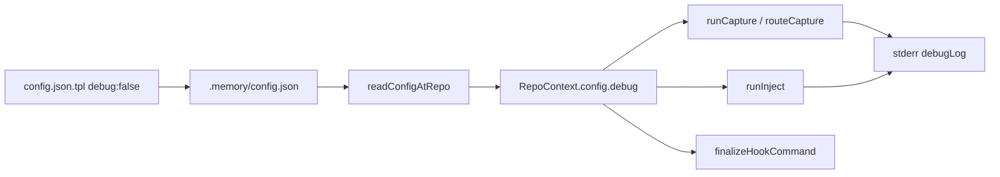

# config.debug 调试日志实现计划

## 目标

- `init` 生成的 [`templates/config.json.tpl`](templates/config.json.tpl) 包含 **`"debug": false`**，用户可在业务仓库手动改为 `true`。
- [`readConfig`](src/config/readConfig.ts) 解析 `debug`；缺省或非法值 → **`false`**（兼容已 init 仓库）。
- capture / inject / hook 错误路径统一走 **`debugLog`**，**仅当 `config.debug === true`** 时向 **stderr** 输出（stdout 仍专供 inject 的 MEMORY 内容）。
- **移除** 所有 `process.env.HERMES_DEBUG` 引用；文档改为配置说明。



## 1. 配置 schema

**模板** [`templates/config.json.tpl`](templates/config.json.tpl)：

```json
{
  "version": 1,
  "storage": { "backend": "file" },
  "assistants": ["claude-code"],
  "debug": false
}
```

**类型** [`src/config/types.ts`](src/config/types.ts)：`HermesConfig` 增加 `debug: boolean`。

**解析** [`src/config/readConfig.ts`](src/config/readConfig.ts)：

```typescript
debug: raw.debug === true,
```

不升级 `version`（仍为 `1`）；旧仓库无 `debug` 字段行为不变。

## 2. 集中日志模块

新增 [`src/config/debugLog.ts`](src/config/debugLog.ts)：

| API | 行为 |
|-----|------|
| `debugLog(enabled, phase, message)` | `enabled` 时 `console.error('hermes-repo [phase] message')` |
| `debugFromContext(ctx, phase, message)` | `ctx?.config.debug` 的简写 |

**约定**：phase 使用 `capture` / `inject`；inject 成功示例：`ok: injected 412 chars`。

## 3. 各模块埋点（替换 HERMES_DEBUG）

### [`src/capture/runCapture.ts`](src/capture/runCapture.ts)

- 删除 `HERMES_DEBUG`。
- `ctx` 为 null → **静默**（无 config 无法读 debug，符合「配置驱动」）。
- `routeCapture` 返回后，若 `ctx.config.debug`，根据 `CaptureResult` 输出：
  - `ok: <capturePath>`（`written: true`）
  - `skip: <reason>`（含 `not initialized` 以外的 router 原因；未 init 已在上面静默）

### [`src/capture/claude-code/run.ts`](src/capture/claude-code/run.ts)

- 删除局部 `HERMES_DEBUG`；详细 skip 由 `runCapture` 统一汇总即可（避免重复）。
- **保留** `--dry-run` 的 `console.log`（显式调试开关，非 hook 默认路径）。

### [`src/capture/router.ts`](src/capture/router.ts)

- 若 `assistants` 不含 `claude-code` 且 `debug`，可打 `skip: claude-code not in assistants`（可选，在 router 或 runCapture 根据 `results[0].reason` 处理）。

建议在 `runCapture` 对 `reason` 做一层友好映射，例如启发式拒绝时附带 `messages=N toolCalls=M`（从 `parseJsonl` 结果传入或仅在 `runClaudeCodeCapture` 内 enrich `reason` 字符串）。

**增强（推荐）**：`heuristic rejected` 时 reason 改为 `heuristic rejected (messages=2, toolCalls=1)`，便于用户感知门槛。

### [`src/inject/runInject.ts`](src/inject/runInject.ts)

| 分支 | debug 消息 |
|------|------------|
| 无 ctx | 静默 |
| 无 MEMORY.md | `skip: MEMORY.md missing` |
| 空内容 | `skip: MEMORY.md empty` |
| 成功 | `ok: injected N chars`（截断后长度） |

### [`src/hookExit.ts`](src/hookExit.ts)

- `finalizeHookCommand(fn, strict?, debug?: boolean)`：catch 时若 `debug`，打印异常信息。
- [`src/commands/capture.ts`](src/commands/capture.ts) / [`src/commands/inject.ts`](src/commands/inject.ts)：在调用前 `loadRepoContext(opts.cwd)` 取 `debug` 传入（与业务 `cwd` 一致）。

## 4. 测试

| 文件 | 用例 |
|------|------|
| [`tests/init.test.ts`](tests/init.test.ts) | `init -y` 后 `config.debug === false` |
| [`tests/readConfig.test.ts`](tests/readConfig.test.ts) | 解析 `debug: true`；缺省为 `false` |
| 新建或扩展 capture/inject 测试 | 临时 repo `debug: true`，spy `console.error` 或捕获 stderr，断言含 `skip:` / `ok:` |

测试里手写 `config.json` 的 helper 需补上 `"debug": false`（或按需 `true`），与 [`tests/capture.test.ts`](tests/capture.test.ts) 等保持一致。

## 5. 文档

- [`docs/phase-2-v0.2-capture.md`](docs/phase-2-v0.2-capture.md)：环境变量表删除 `HERMES_DEBUG`，改为 `config.json` 的 `debug` 说明。
- [`README.md`](README.md)：开发调试小节（改 `.memory/config.json` → `"debug": true`；日志在 stderr）。
- [`docs/hermes-repo-design.md`](docs/hermes-repo-design.md) § 配置：在 v0.1 字段表增加 `debug` 行（可选，一行即可）。

## 6. 版本与迁移

- **patch**：`package.json` `0.2.0` → **`0.2.1`**（配置 schema 向后兼容，行为增强）。
- **已 init 项目**：不自动改写 `config.json`；用户手动加 `"debug": true` 或重新 `init`（默认 skip 已有 config，与现有一致）。

## 7. 明确不做

- 不把 debug 日志写入 stdout（避免破坏 inject hook 契约）。
- 不保留 `HERMES_DEBUG` 兼容层（按你的需求纯 config 驱动）。
- 不为未 init 目录提供 debug（无 config 可读）。

## 实现顺序

1. types + readConfig + debugLog + config 模板  
2. runCapture / runInject / hookExit + commands 传 debug  
3. enrich capture skip 消息（启发式 / jsonl）  
4. 测试 + 文档 + 版本 0.2.1
