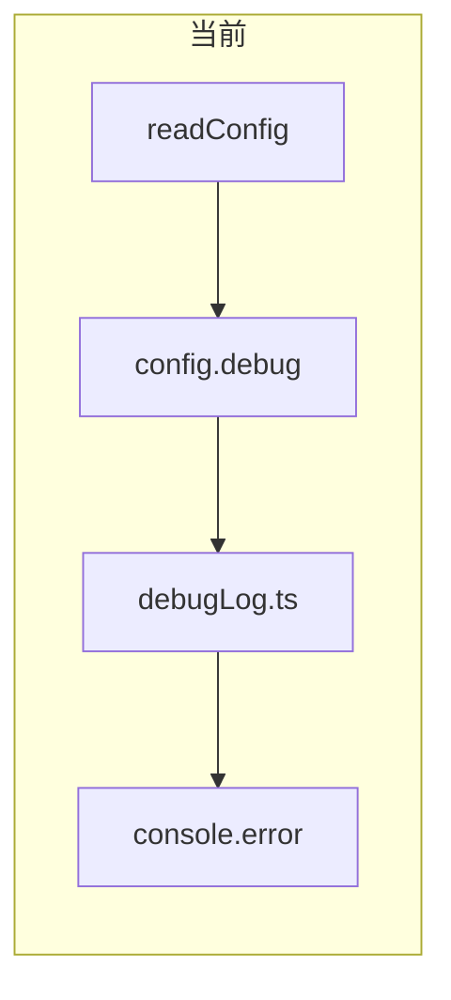
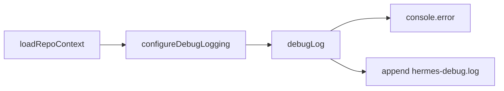

# config.debug 写入 `.memory` 日志文件

## 目标

当 [`.memory/config.json`](.memory/config.json) 中 `"debug": true` 时：

- 在仓库 `.memory/hermes-debug.log` **追加**所有 hermes-repo 调试日志
- **同时**继续输出到 `stderr`（你已选择双写）
- 日志文件纳入个人层 gitignore，不提交

## 现状



- 统一入口：[`src/config/debugLog.ts`](src/config/debugLog.ts)（`runCapture` / `runInject` / `hookExit` 等调用）
- 无 `RepoContext` 时（找不到 `.memory`）不启用 debug，与现行为一致
- [`src/capture/claude-code/run.ts`](src/capture/claude-code/run.ts) 的 `--dry-run` 仍用 `console.log`，需纳入同一管道

## 方案



### 1. 扩展 `debugLog.ts`

在 [`src/config/debugLog.ts`](src/config/debugLog.ts) 增加进程级配置（单次 hook/CLI 进程内有效）：

```typescript
export function configureDebugLogging(repoRoot: string | null, enabled: boolean): void
```

- `enabled && repoRoot`：目标路径 `join(repoRoot, '.memory', 'hermes-debug.log')`
- 首次写入前 `mkdirSync(dirname, { recursive: true })`（复用现有 [`memoryPath`](src/config/paths.ts) 或等价逻辑）
- 每行格式：`2026-05-20T12:34:56.789Z hermes-repo [phase] message\n`（ISO 时间 + 现有 phase 前缀）
- `debugLog(enabled, phase, message)`：`enabled` 时 `console.error` + `appendFileSync`（`flag: 'a'`）；未 `configure` 时仅 stderr（兼容测试里只传 boolean 的路径）

在命令入口各调用一次 `configureDebugLogging`：

- [`src/commands/capture.ts`](src/commands/capture.ts) — `loadRepoContext` 之后
- [`src/commands/inject.ts`](src/commands/inject.ts) — 同上

`hookExit` 无需改签名：命令层已 configure，[`finalizeHookCommand`](src/hookExit.ts) 仍传 `debug` boolean 即可写文件。

### 2. 收敛其它调试输出

| 位置 | 改动 |
|------|------|
| [`run.ts` dry-run](src/capture/claude-code/run.ts) | `console.log` → `debugLog(debug, 'capture', ...)`（调用方传入 `debug` 或从 capture 链路透传） |
| [`runCapture.ts`](src/capture/runCapture.ts) | 在 `logCaptureResult` 中当 `reason === 'heuristic-rejected'` 时附带 `messages` / `toolCalls`（已有）并可加 `jsonlPath`（从 capture 结果或 resolve 层传入，便于排查你遇到的 `toolCalls=0`） |

**不纳入**（非 debug 语义）：`init` 正常 stdout、`inject` 的 MEMORY 正文、`capture` 成功时的落盘路径提示（除非已是 `debugLog`）。

### 3. Gitignore 与 init

- [`templates/gitignore-block.txt`](templates/gitignore-block.txt) 增加一行：`.memory/hermes-debug.log`（与 `captures/`、`personal/` 同级，个人层不提交）
- `init` **不必**预创建空日志文件；首次 debug 写入时创建即可

### 4. 测试

新增 [`tests/debugLogFile.test.ts`](tests/debugLogFile.test.ts)（或并入现有 config/capture 测试）：

- 临时仓库 + `config.json` `{ "debug": true }`
- `configureDebugLogging` + `debugLog` 或跑 `runCaptureCommand`（skip 路径即可）
- 断言 `.memory/hermes-debug.log` 存在且包含 `hermes-repo [capture]` 子串
- `debug: false` 时不创建/不追加（或文件不存在）

### 5. 文档与版本

- [`docs/hermes-repo-design.md`](docs/hermes-repo-design.md) — `config.debug` 小节：说明 `hermes-debug.log` 路径、双写 stderr、gitignore
- [`docs/phase-2-v0.2-capture.md`](docs/phase-2-v0.2-capture.md) — 调试章节补充「查看日志：`tail -f .memory/hermes-debug.log`」
- [`README.md`](README.md) — 一行指向上述文件
- [`package.json`](package.json) patch：`0.2.3`

## 使用方式（实现后）

```bash
# 业务仓库
cat .memory/config.json   # "debug": true
tail -f .memory/hermes-debug.log
```

Hook 触发后可在日志中看到完整链路：`[capture]` resolve / heuristic / `[inject]` / `[hook]` 异常等。

## 刻意不做（YAGNI）

- 日志轮转、按日分文件、`config.debugLogPath` 可配置项
- 捕获 `console.error` 全局劫持（仅 hermes-repo 自有 `debugLog` 路径）
