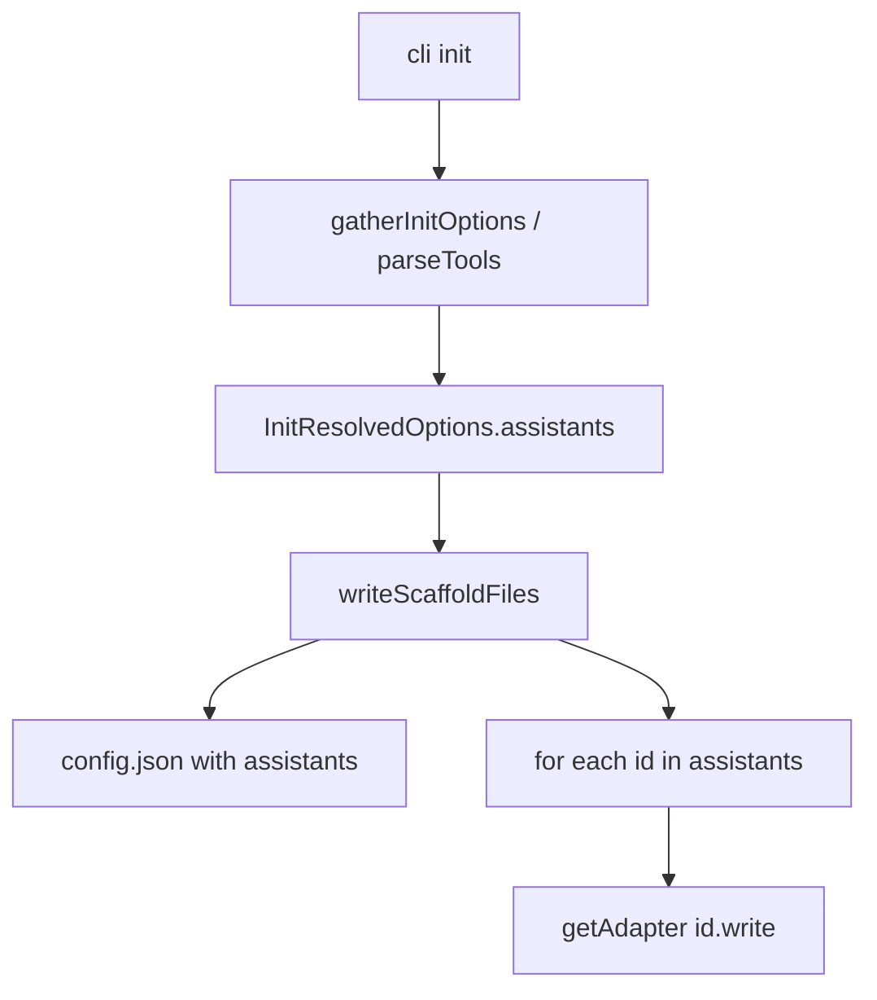

# init 编程助手多选实施计划

依据 [docs/hermes-repo-design.md](docs/hermes-repo-design.md) 中「init 与编程助手接入」章节，在现有 Phase 1 实现上做一次 **v0.1.x 增量**（建议版本 `0.1.1`，`config.json` 增加 `assistants` 字段）。

## 现状与目标差距

| 已有 | 待做 |
|------|------|
| 无条件写 `.claude/hooks.json`（[writeScaffoldFile.ts](src/init/writeScaffoldFile.ts) L99-106） | 仅当 `assistants` 含 `claude-code` 时写入 |
| `config.json.tpl` 无 `assistants` | 动态生成含 `assistants: [...]` |
| [prompts.ts](src/init/prompts.ts) 无助手选择 | `checkbox` 多选 |
| [cli.ts](src/cli.ts) 无 `--tools` | 非交互指定助手 id |
| 无适配器层 | `src/init/assistants/*` 注册表 |



## 架构：Assistant Adapter 注册表

新增目录 [src/init/assistants/](src/init/assistants/)：

| 文件 | 职责 |
|------|------|
| `types.ts` | `AssistantId`（`claude-code` \| `cursor` \| …）、`AssistantAdapter` 接口、`WriteContext`（`repoRoot`, `force`, `report`） |
| `registry.ts` | `ASSISTANT_REGISTRY`、`getAdapter(id)`、`listAvailable()`（仅 `available: true`）、`parseToolsArg("claude-code,cursor")` 校验 |
| `claude-code.ts` | `mkdir .claude`；用现有 [hooks.json.tpl](templates/hooks.json.tpl) 写 `.claude/hooks.json` |
| `cursor.ts` | **占位**：`available: false`，`write` 空实现；**不**进入 checkbox / `--tools` 合法值 |

接口要点（与设计文档一致）：

```typescript
interface AssistantAdapter {
  id: AssistantId;
  label: string;
  available: boolean;
  scaffoldPaths: string[]; // 如 [".claude/hooks.json"]
  write(ctx: WriteContext): void;
}
```

抽取共享写入逻辑：将 [writeScaffoldFile.ts](src/init/writeScaffoldFile.ts) 中的 `writeIfAllowed` / `shouldWriteFile` 复用于 adapter（或 export 供 adapter import），避免重复。

## 数据流与合并策略

**用户确认**：二次 init 时 `assistants` 使用 **并集**（保留已有 id + 追加本次新选）。

实现 [src/init/mergeAssistants.ts](src/init/mergeAssistants.ts)（或放在 `registry.ts`）：

1. 读取已有 `config.json` 的 `assistants`（无则 `[]`）
2. `merged = [...new Set([...existing, ...selected])]`
3. 写回 `config.json` 时使用 `merged`
4. **仅对 `merged` 中各 id** 调用 `adapter.write`（未选中的助手不写入 hooks）
5. **不删除** 未选中助手已存在的 hooks 文件（设计：v0.1 不 prune）

`init -y` 默认 `assistants: ["claude-code"]`；`--tools` 覆盖「本次选择」，再与已有 config 做并集。

## 文件级改动

### 1. 类型与 CLI — [src/init/types.ts](src/init/types.ts)、[src/cli.ts](src/cli.ts)

- `InitCliOptions` / `InitResolvedOptions` 增加 `assistants: AssistantId[]`
- `InitCliOptions.tools?: string`（CLI `--tools`）
- `InitReport` 可选增加 `assistants: AssistantId[]` 便于摘要输出

```typescript
.option("--tools <ids>", "逗号分隔的助手 id，如 claude-code（须与 -y 合用）")
```

`runInitCommand` 传入 `tools`。

### 2. 解析与交互 — [src/init/prompts.ts](src/init/prompts.ts)、[src/init/runInit.ts](src/init/runInit.ts)

**非交互**（`runInit.ts`）：

- `-y` 且无 `--tools` → `["claude-code"]`
- `-y` 且 `--tools` → `parseToolsArg`；未知 / `available: false` → `stderr` + `exit(1)`
- 非 `-y` 传 `--tools` → warn 忽略或报错（建议：要求与 `-y` 同用）

**交互**（`prompts.ts`）：

```typescript
import { checkbox } from "@inquirer/prompts";

const assistants = await checkbox({
  message: "选择要接入的编程助手（可多选）",
  choices: listAvailable().map((a) => ({
    name: a.label,
    value: a.id,
    checked: a.id === "claude-code",
  })),
  validate: (v) => v.length > 0 || "请至少选择一项",
});
```

移除 `prompts.ts` 中 `opts.yes` 早退死代码（L27-34，当前由 `runInit` 分支处理）。

### 3. 写入 — [src/init/writeScaffoldFile.ts](src/init/writeScaffoldFile.ts)

- 新增 `buildConfigJson(assistants: AssistantId[]): string`（不再仅用静态 tpl 写 config；tpl 可保留作参考或删除 `assistants` 段）
- 删除硬编码 `.claude/hooks.json` 块
- 末尾：`for (const id of opts.assistants) getAdapter(id).write(ctx)`
- `writeScaffoldFiles` 入参使用 **合并后** 的 `assistants`（由 `runInit` 在调用前 merge）

### 4. AGENTS.md（可选、小范围）

在 [templates/AGENTS.md.tpl](templates/AGENTS.md.tpl) 增加「已启用助手」小节，占位符 `__ENABLED_ASSISTANTS__`，由 `renderTemplate` 或专用函数替换为 bullet 列表（如「Claude Code — hooks: `.claude/hooks.json`」）。若控制 diff，可 v0.1.x 先做 config 不写 AGENTS。

### 5. 模板 — [templates/config.json.tpl](templates/config.json.tpl)

增加 `"assistants": ["claude-code"]` 作为文档示例；运行时以代码生成为准。

### 6. 文档 — [docs/phase-1-v0.1-init.md](docs/phase-1-v0.1-init.md)、[README.md](README.md)

- 补充交互项、`--tools`、`config.assistants` schema
- 快速开始增加 `init -y --tools claude-code`
- 文件结构树增加 `src/init/assistants/`

设计文档 [hermes-repo-design.md](docs/hermes-repo-design.md) **已更新**，本任务无需再改（除非实现与设计有偏差时回写）。

### 7. 版本

[package.json](package.json) `0.1.0` → `0.1.1`；更新 [tests/cli.test.ts](tests/cli.test.ts) 版本断言。

## 测试 — [tests/init.test.ts](tests/init.test.ts)

| 用例 | 断言 |
|------|------|
| 现有 `init -y` | `config.assistants` 含 `claude-code`；hooks 仍存在 |
| `init -y --tools claude-code` | 同上 |
| `init -y --tools unknown` | exit ≠ 0 |
| `init -y` 无 claude（若未来有多选可测「仅选 A 不写 B hooks」） | v0.1 仅 claude，可直测 `runInit({ assistants: [] })` 应在校验层失败；或 mock 后仅测 merge 函数 |
| 二次 init 并集 | 第一次 `claude-code`，手动改 config 加假 id 不存在 → 第二次 `-y` 保留假 id + 补 hooks |
| 未选 claude 不删 hooks | 先 init，删 config assistants 仅测文件：第二次若实现「空选」不允许；重点测 **不 prune** `.claude/hooks.json` 当未在列表（需 `runInit` 传空 — 应用 validate 阻止） |
| `config.json` 无 `mcp` | 保持 |
| 报告 | stdout 含 `assistants: claude-code`（可选） |

新增单元测试 [tests/assistants.test.ts](tests/assistants.test.ts)（可选）：`parseToolsArg`、`mergeAssistants` 纯函数。

## 明确不做（本迭代）

- Cursor / Codex hooks 实现（仅 registry 占位）
- 取消勾选时删除 `.claude/hooks.json`
- Phase 2 `capture` 读 `assistants`（仅注释 / 导出 `readConfigAssistants` 供后续使用亦可）
- `storage.mcp`、AGENTS 按助手拆分多文件

## 验收

1. `bun run test` + `bun run typecheck` 全绿
2. 交互：`init` 出现助手 checkbox，默认勾选 Claude Code
3. `init -y` 行为与现网一致（默认 claude + hooks）
4. `config.json` 含 `assistants: ["claude-code"]`
5. 二次 `init -y` 并集不丢已有 assistant id
6. `dist/templates` 构建不受影响

## 实施顺序（约 0.5–1 天）

1. `assistants/types` + `registry` + `claude-code` adapter
2. `mergeAssistants` + `buildConfigJson` + 改造 `writeScaffoldFile`
3. `types` / `runInit` / `prompts` / `cli --tools`
4. 测试 + 文档 + 版本 0.1.1
