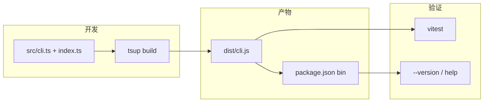

# Phase 0：工程基座（0.5–1 天）

> **状态**：已完成（验收：install / build / version / help / test / typecheck 均已通过）

## 现状


| 已有                                                                                                 | 缺失                                    |
| -------------------------------------------------------------------------------------------------- | ------------------------------------- |
| [README.md](README.md)、[docs/hermes-repo-design.md](docs/hermes-repo-design.md)、[LICENSE](LICENSE) | `package.json`、`src/`、`tsconfig`、构建配置 |
| 根目录残留 `node_modules/`（无锁文件，与当前仓库不同步）                                                               | 可复现的安装与 CI                            |
| `.gitignore` 已忽略 `dist/`、`node_modules/`                                                           | CLI 入口与测试                             |


**策略**：按新设计（`.memory/` 模型）**从零搭脚手架**，不恢复旧的 `.hermes-repo` 实现；Phase 0 只交付「能跑的空 CLI」，`init` 留给 Phase 1。

**已确认选型**：Bun + Node `>=20`（[.nvmrc](.nvmrc) 写 `20`）。

---

## 目标架构




---

## 交付清单

### 1. 清理并锁定依赖

- 删除残留 `node_modules/`，用 `bun install` 重新生成 [bun.lock](bun.lock)。
- 新增 [package.json](package.json) 核心字段：

```json
{
  "name": "@riconext/hermes-repo",
  "version": "0.0.0",
  "type": "module",
  "bin": { "hermes-repo": "./dist/cli.js" },
  "files": ["dist"],
  "engines": { "node": ">=20" },
  "scripts": {
    "build": "tsup",
    "dev": "tsup --watch",
    "test": "vitest run",
    "typecheck": "tsc --noEmit",
    "prepublishOnly": "bun run build"
  }
}
```

- **运行时依赖**：`commander`（CLI 框架，Phase 1+ 子命令沿用）。
- **开发依赖**：`typescript`、`tsup`、`vitest`、`@types/node`。
- Phase 0 **不引入** `@inquirer/prompts`（Phase 1 `init` 交互再加）。

### 2. TypeScript 与构建


| 文件                               | 要点                                                                                        |
| -------------------------------- | ----------------------------------------------------------------------------------------- |
| [tsconfig.json](tsconfig.json)   | `strict: true`，`module`/`moduleResolution` 对齐 Node ESM，`rootDir: src`，`outDir` 仅给 tsc 检查用 |
| [tsup.config.ts](tsup.config.ts) | 入口 `src/cli.ts`；输出 ESM 到 `dist/`；`#!/usr/bin/env node` banner；生成 `.d.ts`（可选，便于后续库导出）      |
| [.nvmrc](.nvmrc)                 | `20`                                                                                      |
| [bunfig.toml](bunfig.toml)       | 可选：`install.auto = "fallback"` 等团队习惯，非必须                                                  |


**构建约定**：发布与本地执行均走 `dist/cli.js`；开发可用 `bun run build` 或 `bun run dev`（watch）。

### 3. 源码骨架

```
src/
├── index.ts      # 导出 PACKAGE_NAME、readVersion() 等常量/工具
└── cli.ts        # shebang + Node 版本门禁 + commander 根命令
tests/
└── cli.test.ts   # 冒烟测试
```

**[src/index.ts](src/index.ts)**

- `export const PACKAGE_NAME = '@riconext/hermes-repo'`
- `export function readPkgVersion(): string`（读相邻 `package.json`，供测试与 CLI 共用）

**[src/cli.ts](src/cli.ts)**（Phase 0 最小行为）

1. **Node 门禁**：`nodeMajor < 20` 时 stderr 提示并 `exit(1)`（与设计文档 engines 一致；旧 spike 的 24+ 不再采用）。
2. **根命令**：`program.name('hermes-repo')`，`description` 对齐 README（跨编程助手项目记忆）。
3. `**-V, --version`**：打印 `readPkgVersion()`。
4. **无子命令**：`argv.length === 0` 时 `outputHelp()` 且 `exit(0)`（与先前 dist 行为一致，避免静默失败）。
5. **暂不注册** `init` / `capture` 等（Phase 1 起按 [设计文档路线图](docs/hermes-repo-design.md) 增量添加）。

### 4. 测试（Vitest）

**[tests/cli.test.ts](tests/cli.test.ts)**

- 使用 `vitest` + `node:child_process` 或 `execa`（优先零额外依赖：`spawnSync`）对 **已 build 的** `dist/cli.js` 断言：
  - `hermes-repo --version` → stdout 含 `0.0.0`
  - `hermes-repo` → stdout 含 `init` 或 `Usage`（仅 help 时尚无 init 子命令，则断言 `hermes-repo` / `记忆` 等 description 关键字）
- 可选：`NODE_OPTIONS` 或 mock 不测 Node 门禁；门禁逻辑可单测 `nodeMajor` 提取函数（若拆到 `src/node.ts`）。

**[vitest.config.ts](vitest.config.ts)**：`test.include: ['tests/**/*.test.ts']`；`beforeAll` 文档注明需先 `bun run build`（或在 `package.json` 中 `"test": "bun run build && vitest run"`）。

### 5. `.gitignore` 微调（可选）

- 保留 `dist/` 忽略（npm `files` 仅发布构建产物，由 `prepublishOnly` 生成）。
- 增加 `.memory/`（后续 dogfood 本地记忆，避免误提交）；Phase 0 可不创建该目录。

### 6. 文档与脚本（轻量）

- [README.md](README.md) 增加 **开发** 小节（3–5 行即可）：

```bash
bun install
bun run build
bun run test
node dist/cli.js --version
```

- **不**在 Phase 0 改 OpenSpec / 实现计划全文（避免范围膨胀）。

### 7. CI（建议同日完成，仍属 Phase 0）

新增 [.github/workflows/ci.yml](.github/workflows/ci.yml)：

- `ubuntu-latest`，Node 20
- `bun install` → `bun run typecheck` → `bun run build` → `bun run test`
- 无 npm publish

---

## 验收标准（Done 定义）

1. `bun install` 成功，存在 `bun.lock`。
2. `bun run build` 生成 `dist/cli.js`（可执行、含 shebang）。
3. `node dist/cli.js --version` 输出 `0.0.0`（或当前 package version）。
4. `node dist/cli.js` 打印 help 且 exit code `0`。
5. `bun run test` 全部通过。
6. `bun run typecheck` 无错误。
7. Node 19 下运行 CLI 有明确错误提示（手工或单测一条即可）。

**明确不在 Phase 0**：`init`、`.memory/` 模板、hooks、capture、storage/MCP 适配器、发布 npm。

---

## 时间分配（参考）


| 时段   | 任务                                  |
| ---- | ----------------------------------- |
| 0.5h | `package.json`、tsconfig、tsup、清理重装依赖 |
| 1h   | `cli.ts` / `index.ts`、本地 build 验证   |
| 0.5h | Vitest 冒烟 + `test` 脚本串联 build       |
| 0.5h | README 开发说明、CI workflow、手工验收        |


---

## Phase 1 衔接

Phase 0 完成后，Phase 1 直接在现有结构上新增：

- `src/commands/init.ts` + `program.command('init')`
- 依赖 `@inquirer/prompts`（仅 init 需要）
- `tests/init.test.ts` 在临时目录跑 `init -y`

无需改动构建管线，除非 init 需要复制 `templates/`（Phase 1 用 `tsup` 的 `onSuccess` 或 `publicDir` 拷贝静态模板）。