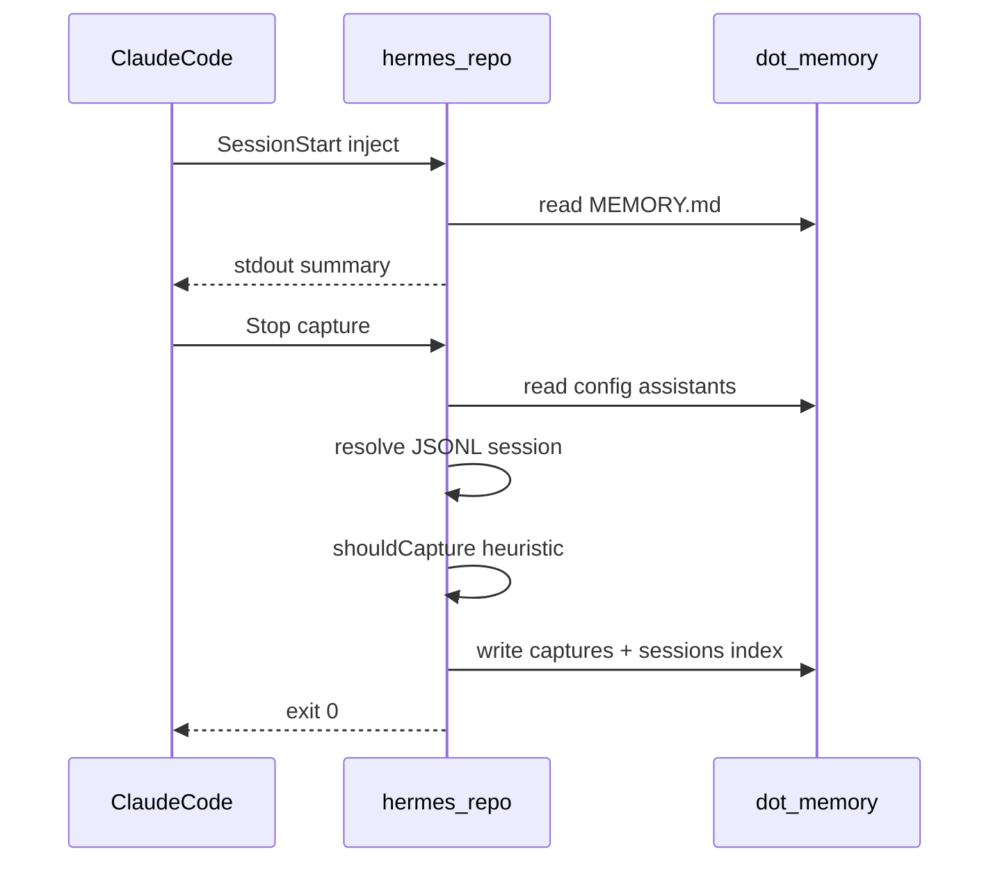

# Phase 2 — v0.2：hooks 闭环（capture + inject）

> **依赖**：[Phase 1 init](docs/phase-1-v0.1-init.md)（v0.1.1 已完成）· **设计依据**：[hermes-repo-design.md](docs/hermes-repo-design.md) § 双通道捕获、Claude Adapter、质量门槛、Level 0  
> **版本目标**：`0.2.0` · **预估**：约 5–7 个工作日（单人）

## 目标与 Done 定义

用户在已 `init` 的仓库中使用 Claude Code 时：

1. **SessionStart** 触发 `inject` → 将 `.memory/MEMORY.md` 摘要输出到 stdout（供 hook 注入上下文），无文件时安静退出。
2. **Stop** 触发 `capture` → 读取最近会话 JSONL → 启发式过滤 → 写入 `.memory/captures/` + 更新 `sessions/index.json`。
3. 两条命令在异常情况下 **exit 0**，不阻塞 Claude Code（[phase-1 衔接](docs/phase-1-v0.1-init.md) L361）。
4. 仅当 `config.assistants` 含 `claude-code` 时执行 Claude 逻辑。



---

## 已确认决策

### `shouldCapture`：无文件变更时仍可捕获（相对设计文档放宽）

[hermes-repo-design.md](docs/hermes-repo-design.md) 伪代码中 `fileChanges.length === 0` 会直接 `return false`。**v0.2 采用以下已确认规则**（产品决策，实施与测试须一致）：

相对设计文档伪代码的**唯一变更**：删除 `if (session.fileChanges.length === 0) return false` 这一行；其余与设计 § 质量门槛一致。

```typescript
if (session.messages.length < 3) return false;
// 不再：if (session.fileChanges.length === 0) return false;

const hasStrongSignal = /* 设计文档信号词列表 */;
const hasUserCorrection = /* 不对|错了|wrong|incorrect 等 */;
const hasComplexTask = session.toolCalls.length > 5;

return hasStrongSignal || hasUserCorrection || hasComplexTask;
```

等价表述：

| 条件 | 是否 capture |
|------|----------------|
| 会话 &lt; 3 轮 | 否 |
| 无文件变更 + 无纠正 + 无强信号 + toolCalls ≤ 5 | 否 |
| 无文件变更 + **有** `hasUserCorrection` 或 **有** `hasStrongSignal` | **是** |
| 有 `hasComplexTask`（与是否有 fileChanges 无关） | 是 |
| 仅有 fileChanges、无任何价值信号 | 否 |

**测试必须覆盖**：fixture「0 file changes + 用户纠正」→ `shouldCapture === true`。

---

## 范围边界

### 本 Phase 做

| 项 | 说明 |
|----|------|
| CLI | `hermes-repo capture`、`hermes-repo inject` |
| 共享 | `src/config/readConfig.ts`（读 `.memory/config.json`） |
| capture 路由 | 按 `assistants` 调用 `claude-code` handler（对称 [src/init/assistants/](src/init/assistants/)） |
| 启发式过滤 | `shouldCapture`（无 LLM）；**无 fileChanges 时若有 userCorrection/强信号仍 capture**（见「已确认决策」） |
| 简单捕获 | 默认 `type: episodic` 或规则推断 semantic；frontmatter + `## 上下文/发现/影响` |
| inject | 读 `MEMORY.md`，截断 ~2200 字符，stdout 输出 |
| 测试 | fixture JSONL + Vitest；CLI 集成测 exit code |
| 文档 | 新增 `docs/phase-2-v0.2-capture.md`；更新 README 命令表 |

### 本 Phase 不做（留给后续版本）

- LLM 提取与三分类精细化（**v0.3**）
- `consolidate` / `flush` / 自动更新 MEMORY.md（**v0.4**）
- consolidate 触发条件检测（capture 末尾仅预留注释或 stub 函数）
- Cursor / 其他助手 capture（**v0.9**）
- `search` / `stats` / `promote`
- MCP、`storage.backend: mcp`

---

## 实施分期（建议严格按序）

### Sprint 2a — Hook 占位（0.5–1 天）

**目的**：`init` 后 Claude Code 立即可用，Stop/SessionStart 不报错。

| # | 任务 | 细节 |
|---|------|------|
| 2a.1 | CLI 注册 | [src/cli.ts](src/cli.ts) 增加 `capture`、`inject` 子命令；`--cwd` 可选，默认 `process.cwd()` |
| 2a.2 | `readConfig` | 无 `.memory/config.json` → 视为未初始化，**exit 0** + stderr 可选 debug |
| 2a.3 | `inject` 占位 | 无 `MEMORY.md` → exit 0；有则 `readFileSync` → stdout 全文（2b 再加截断） |
| 2a.4 | `capture` 占位 | 无 `claude-code` in assistants → exit 0；否则 exit 0 + 可选 log「v0.2 stub」 |
| 2a.5 | 错误策略 | `runCapture`/`runInject` try/catch → **exit 0**（hook 路径）；仅 CLI 直接调用且显式 `--strict` 时可 exit 1（可选，非必须） |
| 2a.6 | 测试 | `tests/capture.test.ts` / `tests/inject.test.ts`：未 init 目录 exit 0；有 MEMORY 的 inject 输出内容 |

**验收**：`bun run build` 后 `node dist/cli.js capture` / `inject` 在空目录与已 init 目录均 exit 0。

---

### Sprint 2b — 实装 capture + inject 增强（4–6 天）

#### 2b.0 调研 Spike（0.5 天，阻塞后续）

Claude Code hook **输入/输出契约**需在实机确认（设计仅给出 JSONL 路径）：

- Stop / SessionStart 是否通过 **环境变量** 传入 `session_id`、`project` path
- JSONL 行格式（message / tool_use 字段名）
- `~/.claude/projects/<hash>/` 与 **cwd 仓库** 的映射方式

产出：在 `docs/phase-2-v0.2-capture.md` 记录「已验证路径与 env」；代码中 `ClaudeSessionResolver` 接口。

#### 2b.1 目录与模块

```text
src/
  config/
    readConfig.ts       # HermesConfig, assistants, storage.backend
    findRepoRoot.ts     # 从 cwd 向上找 .memory/config.json
  capture/
    types.ts            # ParsedSession, CaptureResult
    router.ts           # routeCapture(config)
    shouldCapture.ts    # 启发式（见「已确认决策」，非设计原文 fileChanges 门禁）
    writeCapture.ts     # 生成 MD + 原子写文件
    sessionsIndex.ts    # 读写 sessions/index.json
    claude-code/
      resolveSession.ts # JSONL 路径 + 解析
      parseJsonl.ts
      run.ts            # claude-code capture 入口
  inject/
    runInject.ts        # 读 MEMORY.md、截断、stdout
  commands/
    capture.ts
    inject.ts
```

与 init 对称：后续 v0.9 增加 `capture/cursor/run.ts`，由 `router` 分发。

#### 2b.2 `capture` 流程

1. `findRepoRoot(cwd)` → 读 [config](templates/config.json.tpl)（`assistants`、`storage.backend === "file"`）
2. `assistants` 不含 `claude-code` → return（exit 0）
3. `resolveSession()` → 最新或 hook 指定 session 的 JSONL；失败 → exit 0
4. `parseJsonl` → `ParsedSession`（messages、合并 text、fileChanges 计数、toolCalls 计数）
5. `shouldCapture(session)` → false 则 exit 0（含已确认：无 fileChanges 但有纠正/强信号 → true）
6. 生成文件名：`capture-YYYY-MM-DD-NNN.md`（按日递增序号，扫描目录）
7. 写入 `.memory/captures/episodic/`（v0.2 默认 episodic；有 strong 架构/约定信号 → `semantic`）
8. frontmatter 对齐 [templates/capture-semantic.example.md](templates/capture-semantic.example.md)：`type`, `date`, `session`, `tags`, `scope: all`, `confidence: pending`
9. 正文：从 JSONL 提取摘要段落（规则拼接用户/助手末几轮，**不用 LLM**）
10. `sessions/index.json` 追加：`{ id, capturedAt, captureFile, assistant: "claude-code" }`（与现有 `{ version: 1, sessions: [] }` 兼容）

#### 2b.3 `inject` 流程

1. `findRepoRoot` + config（无 config → exit 0）
2. 读 `.memory/MEMORY.md`；不存在或仅占位 → exit 0
3. 若长度 > **2200** 字符（设计 Level 0 上限）→ 截断并附加 `\n\n...(truncated)`
4. stdout 输出；可选 stderr 一行 meta（`HERMES_INJECT_CHARS=...`，仅 debug 环境变量开启）
5. 暂不读 `MEMORY-*.md`（scope 文件 v0.4+ 再议）

#### 2b.4 CLI 选项（最小集）

| 命令 | 选项 | 用途 |
|------|------|------|
| `capture` | `-C, --cwd` | 仓库根 |
| `capture` | `--dry-run` | 打印将捕获摘要，不写文件（便于调试，非 hook 使用） |
| `inject` | `-C, --cwd` | 仓库根 |

hook 调用无参数；**不要**要求 `-y`（与 init 不同）。

---

## 测试计划（[tests/](tests/)）

| 文件 | 用例 |
|------|------|
| `config.test.ts` | `findRepoRoot`、`readConfig` 解析 assistants |
| `shouldCapture.test.ts` | <3 轮 false；有 user correction true；**无 file changes + 纠正/强信号 → true**；无 file changes 且无信号 → false |
| `capture.test.ts` | fixture JSONL → 生成 md；重复 capture 新序号；无 config exit 0 |
| `inject.test.ts` | 有/无 MEMORY；超长截断 |
| `cli` 扩展 | `hermes-repo --help` 列出 capture/inject |

**Fixtures**：`tests/fixtures/session-minimal.jsonl`、`session-rich.jsonl`（含纠正、多 tool call）、`session-no-files-correction.jsonl`（0 file changes + 用户纠正）。

**集成**：`spawn` `node dist/cli.js capture` 在 `mkdtemp` + `init -y` 目录。

---

## 文档与版本

- 新建 [docs/phase-2-v0.2-capture.md](docs/phase-2-v0.2-capture.md)（结构对齐 phase-1：交付清单、验收、与 v0.3 衔接）
- [README.md](README.md)：capture/inject 用法、hook 行为说明
- [package.json](package.json) → `0.2.0`

---

## 验收标准（10 条）

1. `bun run test` + `bun run typecheck` 全绿。
2. 未 init 仓库：`capture` / `inject` exit 0，不写文件。
3. `init -y` 后：`inject` stdout 含「项目记忆」占位文案。
4. `config.assistants` 无 `claude-code` 时 `capture` 不写 captures。
5. fixture 会话通过启发式后，`.memory/captures/**` 新增 md，frontmatter 合法。
6. `sessions/index.json` 新增一条记录且 JSON 可解析。
7. 启发式不通过时会话不落盘；**无 file changes 但有用户纠正的 fixture 应落盘**。
8. `capture` / `inject` 抛错时 hook 模式仍 exit 0。
9. `--dry-run` 不写盘（若实现）。
10. **不做**：LLM、consolidate 自动触发、MEMORY 内容自动更新。

---

## 与 Phase 1 资产对照

| Phase 1 产出 | Phase 2 用法 |
|--------------|--------------|
| [templates/hooks.json.tpl](templates/hooks.json.tpl) | 已指向 capture/inject，无需改（除非调研发现需 env 包装脚本） |
| [src/init/paths.ts](src/init/paths.ts) `captures/*` | `writeCapture` 目标路径 |
| `sessions/index.json` schema | `sessionsIndex.ts` 追加 |
| [src/init/assistants/registry.ts](src/init/assistants/registry.ts) | capture router 复用 `AssistantId` 类型 |

---

## 风险与缓解

| 风险 | 缓解 |
|------|------|
| Claude JSONL 格式/路径变更 | 2b.0 spike + resolver 隔离；测试用 fixture |
| hook 未传 session id | 回退：取 project 目录最新 jsonl |
| Stop hook 超时 | 不做 consolidate；控制解析量（仅末 N 条消息） |
| 捕获质量差 | v0.2 接受「简单 episodic」；v0.3 LLM 提升 |

---

## 与 v0.3 衔接

v0.2 捕获文件已带标准 frontmatter 后，v0.3 只需：

- 在 `shouldCapture === true` 分支插入 LLM 格式化
- 精确输出 `semantic` / `episodic` / `procedural`

预留：`src/capture/formatCapture.ts` 接口，`simpleFormat`（v0.2）与 `llmFormat`（v0.3）可替换。

---

## 建议执行顺序（Checklist）

1. 2a：CLI + 占位 + 测试  
2. 2b.0：Claude hook / JSONL spike 并写入 phase-2 文档  
3. 2b：`config` → `shouldCapture` → `writeCapture` → `claude-code/run`  
4. `inject` 截断与测试  
5. README + 版本 0.2.0 + 全量验收
