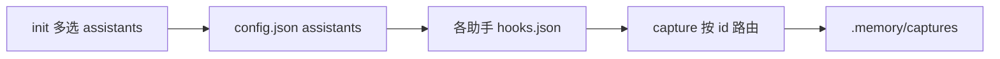
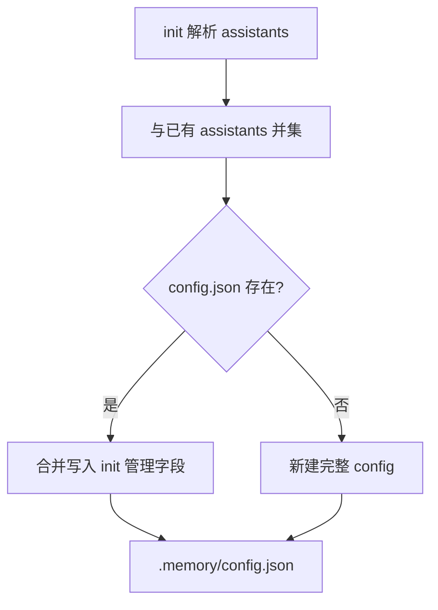

# @riconext/hermes-repo — 跨编程助手记忆系统

## 概述

一个 npm 包，用户安装后在项目中生成持久化的记忆系统。通过编程助手（Claude Code / Cursor / Codex 等）提供的 hooks 能力，自动捕获使用上下文，逐步构建项目级记忆，让 AI 助手越来越了解这个仓库。

参考架构：Hermes Agent 的三层记忆系统、Nous Research 的技能闭环。

远期可选：**独立 MCP 记忆服务** + 数据库存储（本仓库 CLI/hooks 通过 `storage.backend: mcp` 对接）；v0.x 仅实现本地 `.memory/` 文件后端。详见「MCP 记忆服务」。

---

## 设计原则

1. **先验证，后完善** — v0.x 用 JSON/Markdown 文件存储，快速验证可行性
2. **不阻塞用户** — hooks 处理必须异步/后台运行
3. **记忆有边界** — 每条捕获有价值，MEMORY.md 有大小上限，无价值的自动过滤
4. **渐进式采用** — `init` 多选助手；先实现 Claude Code adapter，再按注册表扩展 Cursor 等
5. **反馈驱动** — 记忆是否有效取决于 AI 是否真正引用它，而非一写了之
6. **存储可插拔** — v0.x 默认本地 Markdown/JSON；远期可切换为独立 MCP 服务 + 数据库，CLI 与 hooks 接口保持稳定

---

## 整体架构

```
用户跑: npx @riconext/hermes-repo init
                │
                ▼
        交互：多选要接入的编程助手（v0.1 仅 Claude Code 可选）
        非交互：init -y [--tools claude-code]  默认 claude-code
                │
                ▼
        在项目中创建:
        ├── .memory/
        │   ├── config.json      # 含 storage + assistants[]（已启用助手 id）
        │   ├── captures/        # [个人] 原始捕获（MD，按记忆类型归档）
        │   ├── personal/        # [个人] 个人笔记
        │   ├── topics/          # [团队] 整理后主题（MD）
        │   ├── skills/          # [团队] 可复用技能
        │   ├── sessions/        # [个人] 会话索引（JSON）
        │   ├── refs/            # [个人] AI 引用记录（反馈数据）
        │   ├── team/            # [团队] 团队决策记录
        │   └── MEMORY.md        # [团队] 自动摘要（注入用）
        ├── AGENTS.md            # 编程助手指令入口（通用，所有助手）
        └── （按 assistants 写入各助手 hooks，见「init 与编程助手接入」）
            例: .claude/hooks.json   # claude-code
            远期: .cursor/hooks.json  # cursor（v0.9+）

用户正常使用编程助手
        │
        ▼
Stop hook 自动触发:
  1. 读取会话 JSONL
  2. 质量过滤（短会话/无价值 → 跳过）
  3. 启发式 + LLM 提取关键信息，分类记忆类型
  4. 写入 .memory/captures/{date}-{seq}.md
  5. 达阈值后触发 consolidate → 去重/冲突检测/更新 MEMORY.md

下次启动编程助手:
  AGENTS.md 被加载 → 引用 .memory/MEMORY.md
  → AI 助手知道项目的历史、约定、常见陷阱

用户可主动:
  - npx @riconext/hermes-repo flush    # 手动触发 consolidate
  - npx @riconext/hermes-repo search   # 全文检索历史记忆
  - npx @riconext/hermes-repo stats    # 查看记忆健康度
```

---

## 支持工具优先级

| 优先级 | 工具 | `assistants` id | init 可选 | hooks 机制 |
|--------|------|-----------------|-----------|-----------|
| P0 | Claude Code | `claude-code` | v0.1+ | Stop / SessionStart / PreCompact / PostCompact → `.claude/hooks.json` |
| P1 | Cursor | `cursor` | 规划中（v0.9） | hooks.json（beforeReadFile, sessionStart, workspaceOpen）→ `.cursor/`（路径以实现为准） |
| P1 | OpenAI Codex | `codex` | 规划中 | hooks 系统 |
| P2 | VS Code Copilot | `copilot` | 规划中 | Agent hooks（Preview） |
| P2 | GitHub Copilot CLI | `copilot-cli` | 规划中 | 主要依赖 AGENTS.md，无专用 hooks |

**说明**：`AGENTS.md` 与 `.memory/` 为**通用**脚手架，与具体助手无关；各助手的差异仅在 hooks 配置文件路径与事件名。`init` 根据用户勾选**仅为已选且已实现的助手**写入对应 hooks。

---

## init 与编程助手接入

### 目标

`init` 阶段让用户**多选**本仓库要接入的编程助手；CLI 通过**助手适配器（Assistant Adapter）**注册表扩展，避免在 `prompts` / `writeScaffold` 中散落 `if (cursor)`。

- **v0.1 实现范围**：注册表中仅 `claude-code` 为 `available: true`；交互多选默认勾选 Claude Code。
- **后续版本**：新增适配器文件并注册即可（如 v0.9 `cursor`）；未实现的 id **不出现在可选列表**，或 UI 灰显且 CLI 拒绝 `--tools` 传入。

### 交互与非交互

| 模式 | 行为 |
|------|------|
| TTY 交互 | `@inquirer/prompts` **checkbox** 多选；至少选一项，否则校验失败 |
| `init -y` | 默认 `assistants: ["claude-code"]`，与当前行为一致 |
| 非 TTY 且无 `-y` | 失败并提示（与现有一致） |
| `init -y --tools <ids>` | 逗号分隔，如 `claude-code`；供 CI / 脚本；未知或未实现 id 报错 |

### 持久化：`.memory/config.json`

`init` 将用户选择的助手 id 写入 **`assistants`**，并与 `version`、`storage`、`debug` 等字段一并持久化。完整 schema 与 **`init` 合并写入规则**见下文「配置（`.memory/config.json`）」；此处仅说明与助手的衔接：

| 要点 | 说明 |
|------|------|
| `assistants` | 注册表中的 `AssistantId` 列表；`capture` / `inject` 按此过滤（例如未包含 `claude-code` 时不读 Claude JSONL） |
| 二次 `init` | **每次** `init` 都会合并更新 `config.json` 中的 init 管理字段；`assistants` 与已有列表做**并集**（保留旧 id + 追加本次选择） |
| 其它脚手架 | `MEMORY.md`、`AGENTS.md` 等仍默认 skip，仅 `--force` 覆盖 |

远期可为单个助手增加嵌套配置（如 `integrations.cursor.hooksVersion`），v0.1 不引入。

### 适配器注册表（实现约定）

```text
src/init/assistants/
  types.ts       # AssistantId、AssistantAdapter 接口
  registry.ts    # 汇总列表、解析 --tools、校验 available
  claude-code.ts # 写 .claude/hooks.json
  cursor.ts      # v0.9+，available: false 直至实现
```

每个适配器至少包含：

| 属性 | 说明 |
|------|------|
| `id` | 如 `claude-code`，写入 `config.assistants` |
| `label` | 交互展示名，如「Claude Code」 |
| `available` | `false` 时不参与 init 写入与 `--tools` 合法值 |
| `scaffoldPaths` | 相对仓库根路径，用于 `--force` 白名单与 init 报告 |
| `write(repoRoot, opts)` | 创建目录并写入 hooks 模板 |

**幂等与取消勾选**：

- 未选中的助手：**不写入**其 hooks；v0.1 **不自动删除**用户已有的 hooks 文件（避免误伤手改配置）。
- **`.memory/config.json`**：每次 `init` 合并写入（见「配置」§ `init` 写入策略），不 skip。
- 其它已存在脚手架文件：默认 skip；`--force` 仅覆盖白名单内、且属于**当前 `assistants` 列表**的文件。
- `.memory/captures/**` 下用户内容永不覆盖、不删除。

### init 产出与助手对应关系

| 助手 id | init 写入（除通用 `.memory/` + `AGENTS.md`） | 路线图 |
|---------|-----------------------------------------------|--------|
| `claude-code` | `.claude/hooks.json` → `capture` / `inject` | v0.1 |
| `cursor` | `.cursor/` 下 hooks 配置（待定） | v0.9 |
| `codex` / `copilot` / `copilot-cli` | 待定；部分助手可能仅依赖 AGENTS.md | 后续 |

通用 `AGENTS.md` 可增加「已启用助手」小节，根据 `config.assistants` 列出说明（可选，避免为每个助手维护独立 AGENTS 文件）。

### 与 capture / inject 的衔接

- Phase 2 `capture`：读取 `config.assistants`，仅当包含 `claude-code` 时处理 Claude Code 会话 JSONL。
- 新助手上线：新增 adapter + 对应 `capture` 子路径；hooks 命令仍统一为 `npx @riconext/hermes-repo capture`（内部路由）。



---

## 记忆类型与分层

### 三种记忆类型

AI 助手在不同场景需要不同类型的记忆，不能混为一谈：

| 类型 | 含义 | 示例 | 写入触发 | 检索策略 |
|------|------|------|---------|---------|
| **语义记忆** (Semantic) | 项目事实、约定、架构决策 | "数据库用 PostgreSQL 15；API 返回统一格式" | 发现项目事实时 | 始终注入 MEMORY.md |
| **情景记忆** (Episodic) | 具体事件的经过和结果 | "上周迁移 DB 超时，根因是连接池太小" | 事件发生后 | 按需搜索（grep / FTS5） |
| **流程记忆** (Procedural) | 操作步骤、执行流程 | "部署步骤: migration → build → push → rollout" | 成功完成复杂操作后 | 匹配场景时自动加载，可晋升为 Skill |

### 记忆分层模型

按容量和延迟分成三层，对应不同检索粒度：

```
Level 0: 系统提示注入
───────────────────────────────────────────────
  文件: MEMORY.md
  内容: "活跃主题" + "最近经验"（语义 + 近期情景摘要）
  大小: ~1KB（上限 2.2K chars，参考 Hermes）
  延迟: 0（已在上下文）
  适合: 当前正在关注的约定，AI 开箱即知

Level 1: 关键词匹配
───────────────────────────────────────────────
  文件: .memory/captures/ + .memory/topics/
  方式: AI 通过 grep / ls 搜索
  触发: AI 发现某个话题需要深入时
        （通过 AGENTS.md 引导行为，注册命令行工具）
  适合: 查找类似问题的历史

Level 2: 全文/语义搜索
───────────────────────────────────────────────
  v0.x: CLI `search` + grep（见 Level 1）
  远期: 独立 MCP 记忆服务（见下文「MCP 记忆服务」）
        - 记忆持久化在 MCP 背后的数据库（非仓库内 .memory/ 文件）
        - MCP 暴露 mem-search / mem-get / mem-ref 等工具
  可选中间态: 仓库内 .memory/memory.db（SQLite FTS5），仅作单机过渡，非最终形态
  触发: AI 主动调用 MCP 工具
  适合: 模糊匹配、跨主题检索、跨仓库/团队集中存储
```

### Level 1 检索如何可靠触发

AGENTS.md 软引导不够可靠，需要辅助机制：

| 方案 | 实现 | 可靠性 |
|------|------|--------|
| AGENTS.md 指令 | 引导 AI "先搜索 .memory/captures/" | 低 |
| CLI 工具注册 | 提供 `npx @riconext/hermes-repo search <关键词>`，AI 可调 | 中 |
| MCP server | 独立记忆 MCP 项目提供 `mem-search` 等工具 | 高（远期，见「MCP 记忆服务」） |

v0.x 使用方案 B，AGENTS.md 中声明搜索命令供 AI 调用。

---

## MCP 记忆服务（远期，独立项目）

> **状态：未实现，仅架构预留。** v0.x–v1.0 仍以仓库内 `.memory/` 文件为唯一存储；本节约束后续拆分边界，避免 hermes-repo 与 MCP 服务职责混淆。

### 为什么单独建 MCP 项目

| 维度 | `@riconext/hermes-repo`（本仓库） | 独立 MCP 记忆服务项目（规划中） |
|------|-----------------------------------|----------------------------------|
| 定位 | 项目内落地：init、hooks、capture、consolidate、文件布局 | 跨项目/跨 IDE 的**记忆存储与 MCP 工具面** |
| 运行形态 | npm CLI + 本地 hooks 子进程 | 常驻或按需启动的 MCP Server |
| 存储 | 默认 `.memory/` Markdown/JSON | **数据库**（如 PostgreSQL / SQLite），由 MCP 独占读写 |
| 消费者 | Claude Code hooks、AGENTS.md、CLI | Cursor / Claude / Codex 等一切支持 MCP 的助手 |
| 发布 | `@riconext/hermes-repo` | 独立包名与部署（本地 stdio / 远程 HTTP 等待定） |

hermes-repo **不内嵌**完整 MCP Server 实现；远期通过配置选择「文件后端」或「MCP 后端」，CLI/hooks 调用同一套**存储抽象接口**，由适配器转发到本地文件或远程 MCP。

### 双后端架构（远期）

```
┌─────────────────────────────────────────────────────────────────┐
│  目标 Git 仓库                                                   │
│  ├── AGENTS.md / hooks（不变）                                   │
│  ├── .memory/config.json   storage.backend: file | mcp         │
│  └── MEMORY.md（Level 0 摘要，两种后端均需可生成/同步）            │
└───────────────────────────┬─────────────────────────────────────┘
                            │
            ┌───────────────┴───────────────┐
            ▼                               ▼
   storage.backend: file              storage.backend: mcp
   ┌────────────────────┐            ┌────────────────────────────┐
   │ .memory/ 目录       │            │ hermes-repo CLI/hooks       │
   │ captures/topics/…  │            │   → MCP 客户端调用           │
   └────────────────────┘            └─────────────┬──────────────┘
                                                   ▼
                                    ┌──────────────────────────────┐
                                    │ 独立 MCP 记忆服务（单独仓库）   │
                                    │  Tools: mem-search, mem-get,   │
                                    │         mem-capture, mem-ref,  │
                                    │         mem-consolidate, …     │
                                    └─────────────┬────────────────┘
                                                  ▼
                                    ┌──────────────────────────────┐
                                    │  数据库（captures/topics/     │
                                    │  refs/skills 等逻辑表）         │
                                    └──────────────────────────────┘
```

### 职责划分

**hermes-repo 保留（无论哪种后端）：**

- `init`：脚手架、AGENTS.md、按用户多选写入各助手 hooks、`config.json`（含 `assistants[]`）
- Stop / SessionStart hook 入口（`capture`、`inject`）
- 质量过滤、启发式、consolidate **编排逻辑**（算法可共享，持久化走适配器）
- 团队层 git 流程：`promote`、`.gitignore` 策略（MCP 模式下团队约定可仍导出为 `topics/` 提交 git，或由 MCP 提供「团队空间」— 实现阶段再定）

**MCP 记忆服务负责：**

- 记忆的 CRUD、全文/向量检索、引用计数（`use_count`）、生命周期状态
- 按 `repo_id` / `workspace` / `scope` 隔离多仓库数据
- 向编程助手暴露标准 MCP Tools（供 Cursor 等直接调用，无需经过 CLI）
- 数据库迁移、备份、多用户鉴权（若部署为远程服务）

### 配置（`.memory/config.json`）

**当前已实现字段（v0.2.1+）：**

```json
{
  "version": 1,
  "storage": {
    "backend": "file"
  },
  "assistants": ["claude-code"],
  "debug": false
}
```

| 字段 | 说明 |
|------|------|
| `version` | 配置 schema 版本，供迁移 |
| `storage.backend` | `"file"`（v0.x 默认） |
| `assistants` | 用户在 `init` 时启用的编程助手 id 列表，见「init 与编程助手接入」 |
| `debug` | `true` 时 `capture` / `inject` 向 **stderr** 输出步骤日志（`init` 写入默认 `false`；用户可改为 `true`） |

#### `init` 对 `config.json` 的写入策略（v0.2.1+）

与其它脚手架文件不同，`config.json` **不参与**「已存在则 skip」的幂等逻辑；每次 `init` 都会写入（报告为 `created` 或 `overwritten`）。



| 场景 | 行为 |
|------|------|
| 文件不存在 | 新建；`assistants` = 本次合并结果；`debug` = `false` |
| 文件已存在 | **合并覆盖** init 管理字段，**保留**其它顶层键与 `storage` 下除 `backend` 外的子字段 |
| 每次写入的字段 | `version: 1`、`storage.backend: "file"`、`assistants`（并集结果）、`debug`（仅当文件中已是 `true` 时保留，否则 `false`） |

实现：`src/init/mergeConfig.ts` 的 `mergeConfigForInit()`；`MEMORY.md`、`AGENTS.md`、hooks 等仍按原幂等 / `--force` 规则。

**调试**：将 `"debug": true` 后，无需环境变量；hook / CLI 在 **stderr** 与 **`.memory/hermes-debug.log`** 双写 `hermes-repo [capture]` / `[inject]` / `[hook]` 前缀日志（每行含 ISO 时间戳；inject 的 stdout 仍仅输出 MEMORY 正文）。日志文件为个人层，由 init 写入的 `.gitignore` 块忽略（`.memory/hermes-debug.log`），不提交。

**远期字段示例（`storage.mcp` 等）：**

```json
{
  "version": 1,
  "storage": {
    "backend": "file",
    "mcp": {
      "server": "hermes-memory",
      "transport": "stdio",
      "command": "npx",
      "args": ["@riconext/hermes-memory-mcp"],
      "repoId": "<git-remote-hash-or-configured-id>"
    }
  },
  "assistants": ["claude-code", "cursor"]
}
```

- `backend: "file"` — 当前设计与 v0.x 实现路径
- `backend: "mcp"` — 所有 capture/consolidate/search 经 MCP 写入数据库；仓库内可仅保留 `MEMORY.md` + `config.json` 作为注入与配置锚点
- `assistants` — 与文件模式 / MCP 模式正交；决定写入哪些 hooks 以及 `capture` 路由哪些会话源

### Level 0 与 MCP 的关系

即使记忆主体在数据库，`MEMORY.md`（及可选 `MEMORY-*.md`）仍建议作为 **Level 0 注入快照**：

- hooks / `inject` 可从 MCP 拉取摘要后写入或直出 stdout（实现时二选一）
- 避免每次 SessionStart 全库查询；大小仍受 ~2.2K chars 限制
- consolidate 在 MCP 模式下由 `mem-consolidate` 触发，hermes-repo `flush` 转为调用 MCP 或本地编排

### 与 v0.x 内嵌 SQLite 的关系

设计文档曾提及仓库内 `.memory/memory.db`（FTS5）作为 Level 2 可选升级。**优先级调整如下：**

1. **v0.x–v1.0**：文件存储 + CLI `search`（无 MCP、无库内 SQLite 要求）
2. **可选中间态**：单仓库 SQLite FTS5（仅当需要离线语义检索且尚未部署 MCP 时）
3. **目标态**：独立 MCP 服务 + 中心数据库，hermes-repo 通过 `storage.backend: mcp` 对接

不在 hermes-repo 内重复实现「完整 MCP Server + 数据库」；避免两个项目各维护一套记忆 schema。

### MCP 工具面（草案，实现时在独立项目中定义）

| 工具 | 用途 |
|------|------|
| `mem-search` | 关键词/语义检索 captures、topics |
| `mem-get` | 按 id 取单条记忆全文 |
| `mem-capture` | 写入捕获（供 hook 或 AI 主动调用） |
| `mem-ref` | 记录引用（反馈回路） |
| `mem-consolidate` | 触发 consolidate，更新摘要与 topics |
| `mem-stats` | 健康度与 use_count 统计 |

hermes-repo 在 `backend: mcp` 时，`capture` / `flush` / `search` / `stats` 命令变为上述工具的薄封装；AI 也可在 IDE 内**直接调 MCP**，与 CLI 并行。

### 迁移路径（文件 → MCP，远期）

1. `npx @riconext/hermes-repo export`（规划）：将 `.memory/` 批量导入 MCP 数据库
2. 修改 `config.json` → `storage.backend: mcp`
3. 可选：`.memory/captures/` 等目录归档或 gitignore，仅保留 `MEMORY.md` + 团队层导出物
4. `init` 对新仓库支持 `--backend mcp`，跳过创建大量空目录，仅写配置与 AGENTS 指引

### 实现阶段（独立 MCP 项目，不在本仓库排期）

| 阶段 | 内容 |
|------|------|
| M1 | MCP Server 骨架 + `mem-search` / `mem-get` + SQLite/Postgres schema |
| M2 | `mem-capture` / `mem-ref` + repo 隔离 |
| M3 | `mem-consolidate` + MEMORY 摘要 API |
| M4 | hermes-repo `storage.backend: mcp` 适配器 + `export`/`import` |
| M5 | 远程部署、鉴权、多租户（若需要） |

---

## 存储设计

### 存储后端模式

| 模式 | 状态 | 说明 |
|------|------|------|
| **file**（默认） | v0.x 实现 | 全部记忆落在 `.memory/` Markdown/JSON，与设计下文目录结构一致 |
| **mcp** | 远期 | 记忆主体在 MCP 服务数据库；本仓库负责 hooks/CLI 与 Level 0 摘要同步，见「MCP 记忆服务」 |
| **file+sqlite** | 可选中间态 | 在 file 模式上增加仓库内 FTS5，非必须 |

### 目录结构（`storage.backend: file`）

```
.memory/
├── captures/                  # [个人] 原始捕获（只追加，不修改）
│   ├── semantic/              # 语义记忆
│   │   └── capture-2026-05-20-001.md
│   ├── episodic/              # 情景记忆
│   │   └── capture-2026-05-20-002.md
│   └── procedural/            # 流程记忆
│       └── capture-2026-05-20-003.md
├── personal/                  # [个人] 个人笔记/草稿（AI 写入，不共享）
├── sessions/                  # [个人] 会话索引
│   └── index.json
├── refs/                      # [个人] AI 引用记录（反馈数据）
│   └── 2026-05-20-auth-ref.json
├── topics/                    # [团队] 整理后的主题（由 consolidate 生成）
│   ├── auth-patterns.md
│   ├── api-conventions.md
│   └── testing-strategy.md
├── skills/                    # [团队] 从流程记忆晋升的技能
│   ├── deploy-flow/
│   │   ├── SKILL.md
│   │   └── references/
│   └── db-migration/
│       └── SKILL.md
├── MEMORY.md                  # [团队] 自动生成的摘要（所有人加载）
├── MEMORY-frontend.md         # [团队] 前端专用摘要
├── MEMORY-backend.md          # [团队] 后端专用摘要
├── team/                      # [团队] 团队决策记录、记忆管理日志
│   ├── decisions/
│   ├── steward-log.md
│   └── conflict-resolutions/
└── .archive/                  # [团队] 归档记忆
```

### 捕获文件格式

```markdown
---
type: semantic              # semantic | episodic | procedural
date: 2026-05-20
session: abc123-xxx
tags: [auth, token, security]
scope: all                  # all | frontend | backend
related-topics: [auth-patterns]
use_count: 3                # AI 引用次数
last_used: 2026-05-25
confidence: confirmed       # pending | confirmed | superseded
superseded_by: capture-2026-06-01-001.md  # （如果已被更新）
---

## 上下文
项目认证模块，token 刷新逻辑。

## 发现
Agent 使用了 localStorage 存储 token，
但架构约定应该用 httpOnly cookie。

## 影响
- 新增规范: auth/token-storage.md
- 修正代码 2 处
- 防止了潜在的 XSS 风险
```

流程记忆捕获示例（更强调步骤和验证）：

```markdown
---
type: procedural
date: 2026-05-20
session: def456-xxx
tags: [deploy, migration, database]
scope: backend
step_count: 6
repeat_count: 2          # 同类流程重复次数，达阈值后可晋升为 Skill
---

## 目标
生产环境数据库迁移，零停机。

## 步骤
1. `pnpm migration:generate` — 生成迁移文件
2. `pnpm migration:status` — 确认待执行变更
3. `pnpm migration:dry-run` — 在 staging 验证
4. 执行 `pnpm migration:apply --production`
5. 检查 `SELECT * FROM _migrations` 确认版本
6. 运行 smoke test 验证关键 API

## 注意
- 步骤 2 必须: 检查是否有 conflict 标记
- 步骤 5 不能省略: 上次跳过导致版本不一致
- 如果迁移涉及表锁，先在低峰期操作

## 验证
- API health check 全部通过
- 迁移版本号一致
- 数据完整性校验通过
```

### MEMORY.md 格式

```markdown
# 项目记忆

最后更新: 2026-05-20 | 总计: 23 条捕获（10 语义 + 8 情景 + 5 流程）
上次 consolidate: 2026-05-19 | 上次 curator: 2026-05-01

## 活跃主题
- **认证方案**: 必须用 httpOnly cookie，不用 localStorage
- **API 约定**: 统一返回格式 {code, data, message}
- **测试策略**: 核心逻辑必须单元测试，e2e 覆盖关键路径

## 最近经验（7天内）
- [2026-05-20] [语义] auth token 存储方式纠正
- [2026-05-19] [情景] prisma 查询 N+1 优化（引用3次）
- [2026-05-18] [流程] docker-compose Redis 配置修正

## 项目约定
- React 函数组件 + TypeScript
- 使用 pnpm workspace
- 后端 ORM 用 Prisma

## 检索提示
搜索历史经验: npx @riconext/hermes-repo search <关键词>
查看主题详情: cat .memory/topics/<主题>.md
查看可用技能: ls .memory/skills/
```

---

## 双通道捕获机制

记忆写入不能只依赖 AI 的自觉性，需要双通道：

| 通道 | 机制 | 可靠性 | 延迟 | 适合场景 |
|------|------|--------|------|---------|
| **主动通道** | AGENTS.md 引导 AI 主动写捕获文件 | 低（AI 可能不遵守） | 实时 | 重大决策、AI 自觉有价值 |
| **被动通道** | Stop Hook 自动捕获会话 → 过滤/提取 | 高（不可跳过） | 异步（秒级） | 全覆盖，系统自动判断 |

被动通道是核心：Claude Code 的 Stop hook 在每次会话结束时触发，读取会话 JSONL，过滤噪声，提取价值，写入捕获。

---

## 编程助手 Adapter 实现

各助手的 hooks 由 `init` 在用户勾选后写入；以下为 **Claude Code**（`claude-code`）适配器，v0.1 唯一可用项。Cursor 等见「支持工具优先级」与路线图 v0.9。

### Claude Code：hooks 配置（`.claude/hooks.json`）

```json
{
  "hooks": {
    "Stop": [
      {
        "hooks": [
          {
            "type": "command",
            "command": "npx @riconext/hermes-repo capture"
          }
        ]
      }
    ],
    "SessionStart": [
      {
        "hooks": [
          {
            "type": "command",
            "command": "npx @riconext/hermes-repo inject"
          }
        ]
      }
    ]
  }
}
```

（Claude Code 官方 [command hook](https://code.claude.com/docs/en/hooks) 嵌套格式；本地开发可改为 `hermes-repo capture` / `inject` 若已 `npm link`。）

### Claude Code：Stop hook 处理流程

```
Claude Code 会话结束
        │
        ▼
读取 Claude 会话 transcript（官方：`~/.claude/projects/<项目目录>/<sessionId>.jsonl`；Stop hook stdin 提供 `transcript_path`）
        │
        ▼
质量过滤（见"质量门槛"章节）
  无价值 → 跳过，退出
        │
        ▼
启发式 + LLM 提取:
  1. 本次解决了什么问题 → 提取影响
  2. 有没有架构决策 → 语义记忆
  3. 有没有纠正/错误 → 语义记忆
  4. 有没有成功流程 → 流程记忆
  5. 事件经过 → 情景记忆
        │
        ▼
分类写入 .memory/captures/{type}/{filename}.md
        │
        ▼
检查 consolidate 触发条件:
  数量 ≥ 10 条
  │ 或 距离上次 ≥ 24 小时且有新捕获
  │ 或 检测到同标签矛盾捕获
  │
  └→ 触发 consolidate（去重 + 冲突检测 + 更新 MEMORY.md）
```

---

## 质量门槛：什么值得记

不是每条会话都有价值。Stop hook 捕获后先过滤：

### 有价值信号

```
✅ 用户纠正了 AI 的错误（"不对"、"错了"、"改成"）
✅ 做出了架构决策（"我们用 Redis 而不是 Memcached"）
✅ 发现了 bug 根因（"因为"、"根因是"）
✅ 新增了代码规范（"约定"、"不要"、"必须"）
✅ 解决了复杂问题（5+ 步的调试，修改了多个文件）
✅ 涉及技术选型或方案对比
```

### 无价值信号

```
❌ 简单问答（"这个函数的参数是什么"）
❌ 重复性操作（"帮我格式化代码"、"解释这段代码"）
❌ 探索性对话无结论（多轮尝试但没有确定方案）
❌ 会话 < 3 轮
❌ 只有文件读取没有修改
```

### 启发式过滤算法（预过滤，减少 LLM 调用）

```typescript
function shouldCapture(session): boolean {
  // 基础过滤
  if (session.messages.length < 3) return false
  if (session.fileChanges.length === 0) return false

  // 信号词匹配
  const strongSignals = [
    '修复', '因为', '改成', '注意', '约定',
    '不要', '必须', '最佳实践', '根因', '原因',
    'fix', 'because', 'change to', 'note', 'convention',
    'never', 'always', 'root cause', 'pattern'
  ]
  const hasStrongSignal = strongSignals.some(w => session.text.includes(w))

  // 用户修正信号
  const hasUserCorrection = session.messages.some(m =>
    m.role === 'user' &&
    /不对|错了|不是这样|不应该|别用|stop|wrong|incorrect/i.test(m.text)
  )

  // 复杂任务信号
  const hasComplexTask = session.toolCalls.length > 5

  return hasStrongSignal || hasUserCorrection || hasComplexTask
}
```

启发式通过后再决定是否需要 LLM 辅助提取详情。简单捕获直接写，复杂捕获用 LLM 格式化。

---

## 记忆生命周期与反馈回路

### 生命周期

```
创建 → 活跃 → 引用次数下降/时间长 → 降级 → 归档
                            ↓
                      用户标记无用 → 直接归档
```

| 阶段 | 条件 | 行为 |
|------|------|------|
| **活跃** | 30 天内被 AI 引用（use_count 新增） | 保留在 MEMORY.md |
| **降级** | 30 天未被引用 | 从 MEMORY.md 移除，保留在 topics/ |
| **归档** | 90 天未被引用 | 移至 .memory/archive/ |

### 反馈回路

没有反馈机制就无法衡量记忆有效性。核心指标：**引用次数**。

```
引用记录机制:
  当 AI 搜索/读取某条捕获时，
  在 .memory/refs/ 下创建引用记录:

  .memory/refs/2026-05-20-auth-ref.json
  {
    "capture": "capture-2026-05-20-001.md",
    "reason": "查看 token 存储约定",
    "session": "xyz-789",
    "date": "2026-05-25"
  }

consolidate 时统计:
  - 引用次数多 + 近期 → 提升重要性，保留在 MEMORY.md
  - 零引用 + 30天 → 降级
  - 用户显式标记 .capture-xxx.ignore → 下次 consolidate 直接归档
```

AGENTS.md 中引导 AI 引用时留下记录，但更重要的是**被动追踪**：

- 统计 `cat .memory/captures/semantic/*.md | grep` 出现的频次（粗糙但零成本）
- 后续可用 MCP server 精确追踪 AI 读取了哪些文件

### 一致性冲突检测

consolidate 时扫描同标签下是否有互相矛盾的捕获：

```
检测到矛盾:
  capture-001 [语义]: "项目用 localStorage 存 token"
  capture-050 [语义]: "项目用 httpOnly cookie 存 token"

处理:
  1. 在 MEMORY.md 中只保留最新版本
  2. 旧捕获标记 confidence: superseded + superseded_by
  3. 两条记录都保留（可追溯变更历史）
  4. 在 MEMORY.md 中标注"已更新"和时间线
```

---

## consolidate 机制

### 触发条件

不仅是简单的"每 10 条"，而是多条件 or 判断：

```
条件 1: 数量驱动  ── 捕获数 ≥ 10 条
条件 2: 时间驱动  ── 距离上次 ≥ 24 小时且捕获数 ≥ 1
条件 3: 一致冲突  ── 同标签下检测到矛盾捕获
条件 4: 用户主动  ── npx @riconext/hermes-repo flush
         ──→ 任一条件满足 → 触发 consolidate
```

### consolidate 做的事

```
1. 读取所有新捕获（上次 consolidate 之后）
2. 去重：
   - 完全相同的合并
   - 相似度高的（同标签 + 同主题）合并摘要
3. 冲突检测：
   - 同标签下信息矛盾 → 保留最新，标记旧版 superseded
4. 更新 topics/：
   - 按标签重新分组，生成/更新主题文件
5. 更新 MEMORY.md：
   - 活跃主题 = 引用最多 + 最新的语义记忆
   - 最近经验 = 7 天内的捕获（按引用次数排序）
   - 如果超过 2.2K chars → LLM 压缩摘要
```

---

## 流程记忆 → 技能生成

流程记忆的最终形态不是留在 captures/ 里等 AI 按需搜索，而是**晋升为可复用的 Skill（技能）**。

Skill 是结构化的流程记忆，AI 看到 Skill 名和描述就能决定是否加载，加载后按步骤执行，无需重新推理。

### 为什么需要 Skill

| 对比 | 原始流程记忆（capture） | 晋升后的 Skill |
|------|------------------------|---------------|
| 使用方式 | AI 搜索到后阅读全文再执行 | AI 看到描述就知道是否匹配 |
| 加载成本 | 全文阅读 + 理解 + 执行 | 渐进式（先看名，再看步骤） |
| 复用性 | 每次需要重新理解上下文 | 标准化格式，即开即用 |
| 可验证 | 无 | 带验证步骤，执行后可确认 |
| 可分享 | 仓库内 | 可跨仓库/跨团队共享 |

### 什么样的流程记忆可以晋升为 Skill

```
晋升条件（满足任一即可）:
├── 相同流程被捕获 ≥ 3 次（被重复执行说明它值得固化）
├── 用户显式要求: "把这个记成技能"
├── AI 判定: consolidate 时认为该流程稳定、通用、可复现
└── 涉及关键操作（部署、迁移、回滚、恢复等高风险操作）

不晋升:
├── 一次性流程（"这次的特例修复步骤"）
├── 非常简单的流程（3 步以内，无需验证）
└── 流程高度依赖特定会话上下文
```

### Skill 文件格式

晋升后的 Skill 遵循 SKILL.md 标准格式，兼容 [agentskills.io](https://agentskills.io) 生态：

```
.memory/skills/<skill-name>/
├── SKILL.md           # 核心文件
├── references/        # 参考文件（可选）
│   └── db-config.md
└── scripts/           # 辅助脚本（可选）
    └── verify.sh
```

SKILL.md 结构：

```markdown
---
name: db-migration
description: >
  生产环境 PostgreSQL 零停机迁移。
  在需要 schema 变更、数据迁移时激活。
version: 1.0.0
author: @riconext/hermes-repo
platforms: [linux, macos]
trigger-tags: [migration, database, postgres, schema]
created-from:
  - capture-2026-05-18-003.md
  - capture-2026-06-01-002.md
  - capture-2026-06-15-001.md
---

## 步骤
1. `pnpm migration:generate` — 生成迁移文件
2. `pnpm migration:status` — 确认无 conflict
3. `pnpm migration:dry-run` — staging 验证
4. `pnpm migration:apply --production`
5. `SELECT * FROM _migrations` 确认版本
6. 运行 smoke test

## 常见陷阱
- 跳过 migration:status 可能导致版本冲突
- 大表迁移必须先检查锁影响
- 迁移回滚不是自动的，需准备 revert 脚本

## 验证
- API health check 全部通过
- 迁移版本号一致
- 受影响表数据完整性校验通过
```

### 渐进式披露

Skill 采用分层加载，节省 token：

```
Level 0: 名称 + 描述 + trigger-tags
─────────────────────────────────
  加载时机: 每次会话（开销极低）
  内容: 目录索引（所有 Skill 的 name + description）
  目的: AI 判断"当前任务是否匹配某个 Skill"

Level 1: 完整步骤
─────────────────────────────────
  加载时机: AI 判断匹配时按需加载
  内容: 全部步骤 + 常见陷阱
  目的: 按 Skill 的流程执行

Level 2: 参考文件
─────────────────────────────────
  加载时机: 执行中需要时
  内容: references/ 下的文件、scripts/ 下的脚本
  目的: 深入细节或执行命令
```

### 技能目录（Level 0）

consolidate 时自动生成技能目录，注入 MEMORY.md：

```markdown
## 可用技能
- **db-migration**: 生产环境 PostgreSQL 零停机迁移 [匹配标签: migration, database]
- **deploy-frontend**: Vercel 前端部署流程 [匹配标签: deploy, frontend]
- **rollback-release**: 生产版本回滚 [匹配标签: rollback, emergency]

使用: AI 判断当前任务匹配时，读取 .memory/skills/<name>/SKILL.md
```

### consolidate 中的技能晋升逻辑

```
consolidate 时扫描 procedural/ 目录
        │
        ▼
按 tags 分组统计
        │
        ▼
对每组检查晋升条件:
  ├── 相同 tag 的捕获 ≥ 3 条
  │   └── 合并生成 SKILL.md
  ├── 用户标记 promote 的捕获
  │   └── 直接生成 SKILL.md
  └── 已有技能但步骤有更新的捕获
      └── 更新 SKILL.md 版本号 + changelog
        │
        ▼
写入 .memory/skills/<name>/
        │
        ▼
更新 MEMORY.md 中的"可用技能"列表
```

### Skill 的生命周期

```
晋升 → 活跃（AI 引用） → 步骤更新（新捕获补充） → 版本迭代
                                                    ↓
                                              长期不匹配 → 降级为流程记忆
                                                    ↓
                                              用户或 curator 主动归档
```

Skill 不走 memory 的 30/90 天降级逻辑，它由**匹配频率**驱动：

| 状态 | 条件 | 行为 |
|------|------|------|
| **活跃** | 30 天内被 AI 加载执行 | 保留在技能目录 |
| **低活跃** | 90 天内未加载 | 从 MEMORY.md 技能目录移除，保留在 skills/ |
| **归档** | curator 检测到步骤长期未更新 + 从未被加载 | 移至 .archive/ |

### 开发优先级

技能生成是进阶功能，在基础记忆管线完善后实现：

| 阶段 | 内容 |
|------|------|
| v0.1-v0.4 | 基础记忆管线（capture → consolidate → MEMORY.md） |
| v0.5 | 技能晋升：procedural 达阈值后自动生成 SKILL.md |
| v0.6 | 技能版本管理 + Level 0 目录注入 MEMORY.md |
| v0.7 | 技能生命周期：匹配频率追踪 + 低活跃降级 |

---

## 冷启动

当 `.memory/` 为空时，AI 没有历史经验。需要初始化方式快速建立基线记忆。

```
方案 A: 项目扫描初始化
─────────────────────────────────
  npx @riconext/hermes-repo init --scan

  自动分析:
  - package.json → 技术栈（React, Prisma, Express...）
  - .gitignore / Dockerfile / Makefile → 基础设施
  - git log --oneline -50 → 近期活跃模块
  - 已有 .cursorrules / CLAUDE.md / AGENTS.md → 迁移已有约定
  - 写入第一批语义记忆

方案 B: 提问式初始化
─────────────────────────────────
  npx @riconext/hermes-repo init --interview

  交互式提问（5-8 个问题）:
  - 项目用什么数据库？
  - 测试框架是什么？
  - 有没有特殊的代码约定？
  - 部署流程是什么？
  - 项目中常见的坑有哪些？

方案 C: 多仓库复用
─────────────────────────────────
  npx @riconext/hermes-repo clone ../other-repo

  按标签过滤复制记忆:
  - 比如只复制 tag:react + tag:typescript
  - 适用于相同技术栈的不同项目
```

---

## 团队协作（10+ 人维护同一仓库）

多人维护同一仓库时，核心矛盾是：**每个人的 AI 产生的记忆是个人的，但项目的约定是团队的。**

如果所有人的 AI 捕获都写入同一个 `.memory/`，就会产生几个问题：

```
问题 1: 噪声爆炸
  10 人 × 每人每天 5 条捕获 = 每天 50 条
  一周 250 条，一个月 1000+ 条
  → MEMORY.md 无法消化，失去意义

问题 2: 记忆冲突
  Alice 的 AI: "API 返回值用 snake_case"
  Bob 的 AI:   "API 返回值用 camelCase"
  → 两条矛盾的捕获同时存在，AI 不知道该信哪个

问题 3: 信任问题
  所有人的捕获自动合并 → 没人敢提交
  每条都审查 → 流程太重

问题 4: 上下文不适配
  Alice 做前端，Bob 做后端
  Alice 的 AI 不需要加载后端的部署流程记忆
```

### 解决方案：两层记忆模型

```
┌────────────────────────────────────────────────────────────────────┐
│                         Git 仓库                                    │
│                                                                    │
│  ┌──────────────────────────┐    ┌──────────────────────────────┐  │
│  │  团队层（Team Layer）     │    │  个人层（Personal Layer）     │  │
│  │  ──────────────────────  │    │  ──────────────────────────  │  │
│  │  提交 git，团队共享       │    │  不提交 git，个人专属         │  │
│  │                          │    │                              │  │
│  │  .memory/topics/         │    │  .memory/captures/           │  │
│  │  .memory/skills/         │    │  .memory/sessions/           │  │
│  │  .memory/MEMORY.md       │    │  .memory/refs/               │  │
│  │  .memory/team/           │    │  .memory/personal/           │  │
│  │  (审批过的约定)           │    │  (自己的 AI 产生的原始数据)   │  │
│  └──────────────────────────┘    └──────────────────────────────┘  │
│                                                                    │
│  流向: personal captures → review → promote → team topics          │
└────────────────────────────────────────────────────────────────────┘
```

### 分层职责

| 层级 | 内容 | 提交 git | 谁维护 | 加载方式 |
|------|------|---------|--------|---------|
| **个人层** | 原始捕获、会话索引、引用记录 | 否（.gitignore） | 自己 | 自己的 AI 读写 |
| **团队层** | 整理后的主题、技能、决策记录 | 是 | 团队审批 | 所有人的 AI 都加载 |
| **管理层** | 记忆健康度、协作规则 | 是 | 记忆管理员 | 按需查看 |

### .gitignore 策略

```gitignore
# 个人层——不提交
.memory/captures/
.memory/sessions/
.memory/refs/
.memory/personal/

# 团队层——提交
!.memory/topics/
!.memory/skills/
!.memory/MEMORY.md
!.memory/MEMORY-*.md
!.memory/team/
!.memory/AGENTS.md
```

### 晋升流程：从个人捕获到团队约定

核心机制：**个人捕获不直接进团队层，必须经过审查晋升**。

```
Alice 的 AI 产生捕获
        │
        ▼
写入 .memory/captures/（仅 Alice 可见）
        │
        │  Alice 觉得这条有价值？
        │  ─────────────
        │  是 → Alice 标记 promote
        │  否 → 留在 captures/ 等 curator 清理
        │
        ▼
Alice 创建 PR:
  .memory/topics/auth-patterns.md（新增/更新）
  引用原始捕获作为依据
        │
        ▼
Code Review（其他人 + 记忆管理员）
  ├── 这条约定对吗？
  ├── 与其他已有约定冲突吗？
  └── scope 设置合理吗？
        │
        ▼
合并 → consolidate 更新 MEMORY.md
       → 所有人的 AI 下次会话时加载新约定
```

**晋升方式**：

```
方式 A: PR 晋升（正式）
─────────────────────────
  Alice 发现 AI 纠正了 token 存储方式
  → 创建一个 PR 修改 .memory/topics/auth-patterns.md
  → 在 PR 描述中引用捕获文件
  → 团队 review 后合并
  → consolidate 检测到 topics/ 变化 → 更新 MEMORY.md

方式 B: 标记 + 批量晋升（轻量）
─────────────────────────
  Alice 觉得某条捕获有价值 → touch .memory/captures/xxx.promote
  每周末 consolidate 扫描所有 .promote 标记
  自动汇总生成变更 → 创建 PR 等待审批
  适合: 不想频繁开 PR 的场景

方式 C: 评审会晋升（定期）
─────────────────────────
  每周记忆评审会:
  1. 回顾本周所有 promote 标记的捕获
  2. 讨论哪些应该进团队层
  3. 当场决定 → consolidate 执行
  适合: 团队刚开始建立记忆文化的阶段
```

### 记忆管理员（Memory Steward）

10 人团队需要有人关注记忆系统的健康度。可以是**轮值制**：

```
职责:
├── 每周 review promote 标记的捕获
├── 处理冲突的团队约定（同 scope 下矛盾的 topics）
├── 触发 curator（清理过时团队记忆）
├── 更新 .memory/team/ 下的团队决策记录
└── 监控记忆健康度指标:
    ├── 本周新增团队层约定数
    ├── 有冲突的 topic 数
    ├── curator 归档数
    └── 团队层 MEMORY.md 大小

轮值周期: 每周一人，交接时有模板
```

### 冲突处理流程

当 consolidate 检测到同 scope 下矛盾的团队层记忆：

```
1. consolidate 自动检测到矛盾:
   topics/frontend-patterns.md: "组件用函数声明"
   topics/frontend-patterns.md: "组件用箭头函数"

2. 在 MEMORY.md 标记为"待解决冲突"

3. 发送通知给当前记忆管理员

4. 管理员处理:
   ├── 确认旧约定已废弃 → 标记 superseded
   ├── 确认新约定不对 → 拒绝新捕获
   └── 两者都有道理 → 拆分为更细粒度的 scope
       （如 "页面组件用函数声明，纯展示组件用箭头函数"）

5. 解决后更新 topics/，清除冲突标记
```

### scope 在团队场景的扩展

在团队场景，scope 不仅是"前端/后端"，还应支持**按模块/服务划分**：

```yaml
# 捕获中的 scope 字段
scope:
  - frontend          # 角色
  - checkout          # 模块/服务
  - payment           # 模块/服务
```

MEMORY.md 按不同维度生成：

```bash
.memory/
├── MEMORY.md                    # scope: all（全员加载）
├── MEMORY-frontend.md           # scope: frontend
├── MEMORY-backend.md            # scope: backend
├── MEMORY-checkout.md           # scope: checkout（仅 checkout 团队加载）
└── MEMORY-payment.md            # scope: payment
```

AGENTS.md 中根据检测到的目录结构自动选择：

```markdown
## 记忆加载
当前工作目录检测: packages/checkout/
自动加载: MEMORY.md + MEMORY-checkout.md
覆盖: 使用 npx memory scope frontend+checkout 强制指定
```

### 团队扩张的记忆文化

10 人团队的 memory 系统能否成功，**50% 靠设计，50% 靠文化**：

```
阶段 1: 仅个人层（1-3 人）
  每个人用自己的 captures/
  topics/ 和 MEMORY.md 手动维护或不用
  目标: 让团队体验"AI 有记忆"的好处

阶段 2: 部分团队层（4-6 人）
  开始晋升有价值的捕获到 topics/
  有记忆管理员轮值
  目标: 建立晋升流程习惯

阶段 3: 完整团队层（7+ 人）
  团队层成为"项目真相源"
  新人入职: git clone → AI 自动加载团队记忆
  目标: 记忆系统成为团队基础设施
```

### 新人入职场景

```
新人 git clone 项目
        │
        ▼
npx @riconext/hermes-repo init
        │
        ▼
读取 .memory/MEMORY.md + scope 相关 MEMORY-*.md
AI 自动了解:
  - 项目技术栈和约定
  - 近期活跃的模块
  - 团队踩过的坑
  - 可复用的技能（部署、迁移...）
        │
        ▼
新人第一次提交代码时
AI 犯的错显著减少
不需要老团队成员反复解释约定
```

---

## 记忆晋升 PR

晋升 PR 是"个人捕获 → 团队层"的关键桥梁。设计原则：

1. **AI 自动生成 PR 正文**，人只做选择题
2. **每条晋升独立勾选**，不搞全盘 approve
3. **勾选结果驱动 action**，不绕弯路
4. **降低认知负担** — 每条一行摘要就够了，不用读完整 capture

### promote 命令

```bash
# 扫描所有 .promote 标记的捕获，生成晋升 PR（推荐日常使用）
npx @riconext/hermes-repo promote --pr

# 指定特定捕获晋升
npx @riconext/hermes-repo promote capture-2026-05-20-003.md capture-2026-05-22-001.md

# 预览晋升结果（不实际创建 PR）
npx @riconext/hermes-repo promote --preview

# 手动处理 PR 结果（合并后标记已处理）
npx @riconext/hermes-repo promote --apply
```

`--pr` 模式工作流程：

```
npx @riconext/hermes-repo promote --pr
        │
        ▼
扫描 .memory/captures/**/*.promote 标记
        │
        ▼
逐条分析（LLM）:
  ├── 内容摘要
  ├── 与现有团队层对比（冲突检测）
  ├── 建议操作（批准/修改/拒绝/延后）
  └── scope 建议
        │
        ▼
生成 PR 正文（勾选框格式）
        │
        ▼
创建 git branch:
  git checkout -b memory-promote/2026-05-20
        │
        ▼
创建 PR:
  git commit + git push
  gh pr create --body <PR 正文>
```

### AI 用于生成 PR 的 Skill

可用一条 Skill 或命令封装这个流程，供 AI 助手调用：

**Skill 形式（.memory/skills/memory-promoter/SKILL.md）**：

```markdown
---
name: memory-promoter
description: >
  将标记 promote 的个人捕获晋升到团队层。
  检测冲突、生成勾选框 PR、根据勾选结果执行操作。
trigger-tags: [memory, promote, 晋升, 记忆]
---

## 流程

### 1. 扫描 promoted capture
```bash
# 找到所有 .promote 标记的捕获
find .memory/captures/ -name "*.promote" | sed 's/\.promote$//'
```

### 2. 逐条分析
对每条捕获，判断：
- 它和现有 .memory/topics/ 中的内容冲突吗？
- scope 和 tags 合理吗？
- 是语义/情景/流程记忆？
- 建议晋升到 topics/ 还是 skills/？

### 3. 生成 PR 正文
模板见 `.memory/templates/PROMOTE_PR.md`

### 4. 创建 PR
```bash
BRANCH="memory-promote/$(date +%Y-%m-%d)"
git checkout -b "$BRANCH"
git add .memory/topics/ .memory/skills/
git commit -m "chore(memory): 晋升 $(date +%Y-%m-%d) 的记忆"
git push origin "$BRANCH"
gh pr create \
  --title "记忆晋升: $(date +%Y-%m-%d)" \
  --body "$PR_BODY" \
  --label "memory"
```

### 5. 处理 PR 回执（合并后）
```bash
npx @riconext/hermes-repo promote --apply
# 根据勾选结果：
# - 批准的 → 保留在团队层
# - 拒绝的 → 移除 .promote 标记
# - 延后的 → 保留 .promote 标记
# - 需修改的 → 根据 comment 更新捕获
```
```

**命令行形式**（直接在 AGENTS.md 中声明）：

```markdown
## 记忆晋升
- 生成晋升 PR: `npx @riconext/hermes-repo promote --pr`
- 预览: `npx @riconext/hermes-repo promote --preview`
```

### PR 正文模板

保存在 `.memory/templates/PROMOTE_PR.md`，由 `promote --pr` 自动填充：

```markdown
## 记忆晋升申请

### 自动扫描结果
本次检测到 {total_count} 条 promoted capture，建议晋升 {ai_approve_count} 条到团队层。

---

{for each capture}

### {□/□/□} {序号}: {标题}
- **来源**: {capture 文件名}（{记忆类型}，{作者}）
- **内容**: {AI 摘要（一行）}
- **AI 判断**: {无冲突/⚠️ 有冲突}
- **scope**: {scope}
- **标签**: {tags}
- **重复次数**: {repeat_count}（仅流程记忆）

{如果有冲突}
- **冲突详情**: {现有约定} vs {新提案}
{/if}

{actions}
- [ ] **批准晋升** — 直接合并到团队层
- [ ] 批准晋升为技能（仅流程记忆）
- [ ] 需要修改 — {请附言说明}
- [ ] 拒绝 — {请附言原因}
- [ ] 延后讨论

{/for}

---

### 操作说明
1. 每一条勾选一个选项
2. 如需说明，在对应项后附言
3. 提交 review → AI 根据勾选结果自动执行

### 本次晋升总览
| 序号 | 摘要 | AI 建议 | scope |
|------|------|---------|-------|
{for each capture}| {序号} | {一行摘要} | {建议操作} | {scope} |
{/for}
```

### 真实场景示例

```markdown
## 记忆晋升申请

### 自动扫描结果
本次检测到 4 条 promoted capture，建议晋升 2 条到团队层。

---

### □ 1: API 响应格式约定
- **来源**: capture-2026-05-20-003.md（语义记忆，@alice）
- **内容**: 所有 API 返回统一格式 `{code, data, message}`
- **AI 判断**: ✅ 无冲突
- **scope**: all
- **标签**: api, convention

- [x] **批准晋升**
- [ ] 需要修改 — {请附言说明}
- [ ] 拒绝 — {请附言原因}
- [ ] 延后讨论

---

### □ 2: Docker 部署流程
- **来源**: capture-2026-05-18-001.md + capture-2026-05-22-002.md（流程记忆，@bob）
- **内容**: 部署步骤和回滚流程
- **AI 判断**: ✅ 无冲突，建议生成技能
- **scope**: backend
- **标签**: deploy, docker
- **重复次数**: 2

- [ ] 批准晋升
- [x] **批准晋升为技能**
- [ ] 仅晋升为主题
- [ ] 需要修改 — {请附言说明}
- [ ] 拒绝 — {请附言原因}
- [ ] 延后讨论

---

### ✗ 3: React 组件命名约定
- **来源**: capture-2026-05-21-001.md（语义记忆，@alice）
- **内容**: "组件文件用 index.tsx 导出"
- **AI 判断**: ⚠️ 有冲突
- **冲突详情**: 现有约定"组件文件用组件名.tsx" vs 新提案"组件文件用 index.tsx"

- [ ] 采纳新约定，废弃旧约定
- [x] **维持旧约定，拒绝新提案**
- [ ] 两者合并（AI 建议: 按组件/页面拆分 scope）
- [ ] 需要团队讨论

---

### □ 4: Prisma 查询 N+1 优化
- **来源**: capture-2026-05-19-001.md（情景记忆，@alice）
- **内容**: 用户列表查询未使用 include，触发 N+1
- **AI 判断**: ⚠️ 建议降级为个人层（单次事件，非通用约定）
- **scope**: backend
- **标签**: prisma, performance

- [ ] 批准晋升
- [ ] 拒绝
- [x] **延后讨论** — 如果重复出现再考虑晋升
```

### PR 的处理管线

```
PR 创建（AI 生成勾选框正文）
        │
        ▼
通知 review 者（GitHub notification）
        │
        ▼
review 者勾选 + 提交 review
        │
        ▼
AI 解析 review 结果:
  ├── 批准的 → 移动/合并到 .memory/topics/ 或 .memory/skills/
  ├── 拒绝的 → 移除 .promote 标记，在原 capture 添加 rejected 原因
  ├── 延后的 → 保留 .promote 标记，下次扫描会再次纳入
  └── 需修改 → 根据评论更新捕获内容，重新生成 PR
        │
        ▼
consolidate 检测到 topics/ 变化 → 更新 MEMORY.md
```

### 批量晋升（无冲突时）

对于 AI 判定为"无冲突 + 纯新增"的晋升，可以跳过人工步骤，走轻量通道：

```bash
# 批量晋升所有 AI 判定为安全的捕获
npx @riconext/hermes-repo promote --auto-safe

# 或: 只晋升指定的安全捕获
npx @riconext/hermes-repo promote capture-xxx.md --auto-safe
```

`--auto-safe` 条件：
- ✅ AI 冲突检测为无冲突
- ✅ scope 明确且合理
- ✅ 不是对现有约定的修改（纯新增）
- ❌ 流程记忆晋升为技能（需要人决定是否真的需要技能）
- ❌ 涉及修改已有团队层

---

## LLM 依赖分析

理解哪些环节需要 LLM、哪些不需要，直接影响系统成本、延迟和架构设计。

### 总览

```
操作                    LLM?     频率            预估成本     关键路径?
─────────────────────────────────────────────────────────────────────
启发式预过滤            不需要    每次 session end   $0         是
捕获写入（简单）        不需要    每次捕获           $0         是
捕获写入（复杂）        可选 LLM  每次捕获           ~$0.01    否
consolidate 去重        不需要    每 10-24h         $0         否
consolidate 冲突检测    不需要*   每 10-24h         $0         否
consolidate MEMORY.md  需要 LLM  每 10-24h         ~$0.02    否
consolidate topic 更新  需要 LLM  每 10-24h         ~$0.01    否
技能晋升检测            不需要    每 consolidate     $0         否
SKILL.md 生成          需要 LLM  每晋升一次          ~$0.03    否
curator 活跃度检查      不需要    每周               $0         否
curator 归档            不需要    每周               $0         否
promote PR 生成        需要 LLM  按需（用户触发）    ~$0.02    否
promote PR review      需要 LLM  每个 PR 一次        ~$0.01    否
```

*冲突检测不需要 LLM：同 scope + 同标签下，对比核心断言句的语义相似度即可，规则引擎能处理大部分。"

### 详细分析

#### 不需要 LLM 的环节

```
操作: 启发式预过滤
位置: Stop hook 触发时，读取 session JSONL 后
做什么: 检查消息数、修改文件数、信号词、用户纠正标记
频率: 每次 session end（每天每人 5-15 次）
输入: session JSONL（纯文本）
输出: true/false（是否继续处理）
成本: $0
```

```
操作: 简单捕获写入
位置: 预过滤通过后
做什么: 提取 session 的文件变更列表、会话轮次、关键信号词
频率: 每次 session end（每天每人 3-8 次通过过滤）
输入: session JSONL
输出: capture markdown（结构化的模板填充）
成本: $0
```

```
操作: consolidate 去重
位置: consolidate 阶段
做什么: 对比新捕获与已有捕获的 tags + title + 摘要文本相似度
频率: 每 10-24h 一次
输入: 捕获文件列表
输出: 去重后的合并列表
成本: $0
```

```
操作: consolidate 冲突检测
位置: consolidate 阶段
做什么: 同 scope + 同 tag 下，检查是否有互斥的断言
       例如 "用 localStorage" vs "用 httpOnly cookie"
频率: 每 10-24h 一次
输入: 同 tag 分组后的捕获集合
输出: 冲突标记列表
成本: $0
```

```
操作: 技能晋升检测
位置: consolidate 结束时
做什么: 统计 procedural 捕获的 repeat_count + 相同 tag 出现次数
        ≥3 次 → 标记为"可晋升"
频率: 每 consolidate 一次
输入: procedural 捕获列表
输出: 建议晋升的技能候选列表
成本: $0
```

```
操作: curator
位置: 每周定时
做什么: 检查文件 mtime → 30/90 天 → 降级/归档
       用户标记 .ignore → 直接归档
频率: 每周一次
输入: 文件系统
输出: 归档操作列表
成本: $0
```

```
操作: promote --apply
位置: PR 合并后
做什么: 解析 review 的勾选结果 → 移动文件 / 移除标记
频率: 每个 PR 一次（每周 1-3 次）
输入: PR review 评论
输出: 文件操作
成本: $0
```

#### 需要 LLM 的环节

```
操作: 复杂捕获提取
位置: 启发式通过后，如果检测到"需要 LLM 提炼"的信号
     （长会话 >20 轮、涉及多个文件、有架构决策关键词）
做什么: 从 session JSONL 中提取:
        上下文、发现、影响、记忆类型、scope 建议
频率: session 的 10-20%（每天每人 1~2 次）
输入: session JSONL（200-500 行）
输出: 结构化 capture 的草案
模型: gpt-4o-mini 级别即可
成本: ~$0.01/次，每天 ~$0.02/人
```

```
操作: MEMORY.md 生成
位置: consolidate 中
做什么: 从 topics/ 中提取活跃主题 + 最近经验
        合并压缩到 2.2K chars 以内
频率: 每 10-24h
输入: 已更新的 topics/ 内容
输出: MEMORY.md 草案
模型: gpt-4o-mini
成本: ~$0.02/次，每天 ~$0.04/10 人团队
```

```
操作: topic 文件更新
位置: consolidate 中
做什么: 新捕获合并到对应 topic 文件
频率: 每 10-24h
输入: topic 文件 + 新捕获列表
输出: 更新后的 topic 文件
模型: gpt-4o-mini
成本: ~$0.01/topic，每天 ~$0.03
```

```
操作: SKILL.md 生成
位置: 技能晋升触发时
做什么: 从多条 procedural capture 中提取:
        通用步骤、常见陷阱、验证方法
频率: 每晋升一次（每周 2-3 次）
输入: 2-5 条相关 procedural capture + 关联 topic
输出: SKILL.md 草案
模型: gpt-4o-mini 或更强（gpt-4o）
成本: ~$0.03/次，每周 ~$0.09
```

```
操作: promote PR 生成
位置: 用户运行 `npx @riconext/hermes-repo promote --pr`
做什么: 逐条分析 .promote 标记的捕获 → 冲突检测 → 勾选框 PR 正文
频率: 按需（建议每周 1-2 次）
输入: 多条 promoted capture + 现有团队层
输出: PR 正文 markdown
模型: gpt-4o-mini
成本: ~$0.02/次
```

### 成本估算总结

```
单人日常使用:
  ├── 无需 LLM:  每次 session（5-15 次/天） $0
  ├── LLM 提取:  1~2 次/天                 ~$0.02/天
  ├── consolidate: 每 10-24h 一次           ~$0.03/天
  └── 总计:                                ~$0.05/天 ≈ $1.5/月

10 人团队:
  ├── 总计个人提取: 10人 × $0.02/天          ~$0.20/天
  ├── consolidate（团队共享）: 每天一次        ~$0.05/天
  ├── promote PR 生成: 每周 2 次             ~$0.04/周
  ├── SKILL.md 生成: 每周 3 次               ~$0.09/周
  └── 总计:                                ~$8/月
```

### 关键路径与可离线策略

```
关键路径（用户等待）:
  Stop hook 处理 ── 必须快（<1s）
  ├── 读 JSONL: 零 LLM
  ├── 启发式过滤: 零 LLM
  ├── 简单写入: 零 LLM
  └── LLM 提取: 可选，作为后台 job 异步执行
                前端无感，用户关掉 terminal 后慢慢跑

非关键路径（后台悄悄做）:
  consolidate ── 完全异步
  skill 晋升 ── 完全异步
  curator ── 每周定时 job
  promote PR ── 用户主动触发，不紧急
```

### 插件的 API Key 策略

用户不需要自备 API Key。`@riconext/hermes-repo` 应复用宿主 AI 工具的能力：

| 方式 | 实现 | 适用场景 |
|------|------|---------|
| **复用 Claude Code 的会话** | 不额外调 API，直接用 Claude 的已有能力（但有限制：hook 中无法随意调 Claude） | v0.x 快速验证 |
| **自带 LLM 后端** | 支持配置 API Key（OpenAI / Anthropic / OpenRouter），默认 gpt-4o-mini 降成本 | 正式使用 |
| **复用 MCP** | 由独立 MCP 记忆项目提供 LLM/检索能力；hermes-repo 仅作客户端 | 远期 `storage.backend: mcp` |

v0.x 建议：**自带 LLM 只需要 gpt-4o-mini 级别**，成本和延迟都低；MCP 与中心库在独立项目中实现，本包不阻塞 v0.x 交付。

---

## AGENTS.md 模板

`AGENTS.md` 为**跨助手通用**入口；各助手的自动捕获依赖 `init` 写入的 hooks（见 `config.assistants`）。可选在模板中增加「已启用助手」列表，与 `config.json` 同步。

```markdown
# 项目指令

## 记忆系统
本项目使用 @riconext/hermes-repo 管理 AI 助手记忆。

核心文件:
- `.memory/MEMORY.md` — 注入到每次会话的摘要
- `.memory/captures/` — 按类型（semantic/episodic/procedural）归档的原始捕获
- `.memory/topics/` — 整理后的主题记忆

## 使用记忆
- 开始新任务前，先读取 `.memory/MEMORY.md`
- 如需查找历史经验: npx @riconext/hermes-repo search <关键词>
- 查看特定捕获: cat .memory/captures/<type>/<文件名>.md
- 查看主题: cat .memory/topics/<主题>.md
- 查看可用技能: cat .memory/skills/*/SKILL.md

## 技能使用
项目自动从重复的流程记忆中生成技能（SKILL.md），存在 `.memory/skills/`。

### 何时加载技能
当你需要执行以下操作时，先查看是否有对应的技能:
1. 部署/发布/回滚
2. 数据库迁移
3. 新模块/新页面创建
4. 重复性配置操作
5. 调试已知类型的问题

### 如何使用
1. 查看技能目录: `ls .memory/skills/`
2. 匹配到任务后: `cat .memory/skills/<name>/SKILL.md`
3. 按步骤执行
4. 执行结束后，在捕获中引用技能名（帮助 consolidate 追踪技能有效性）

## 何时搜索过去经验
当你遇到以下情况，应主动搜索 .memory/ 中的历史记忆:
1. 处理你之前解决过类似问题的模块
2. 需要进行与上次类似的技术选型
3. 用户说"之前不是这样"或"上次讨论过"
4. 需要了解项目的历史架构决策

## 记录新经验
当你遇到以下情况，在 `.memory/captures/` 创建捕获文件:

1. 你犯了错误并被用户纠正
2. 你发现代码与已有约定不一致
3. 你了解到项目特有的架构决策（包括被否决的方案）
4. 你做出了非平凡的设计选择（包括为什么选 A 不选 B）
5. 你重复遇到了类似问题（说明前一次的经验没有被记住）
6. 你完成了复杂的多步操作流程

### 分类参考
- **语义记忆**: 事实、约定、决策原则 → type: semantic
- **情景记忆**: 具体事件经过 → type: episodic
- **流程记忆**: 操作步骤 → type: procedural

### scope 选择
- 这个经验适用于整个项目吗？→ scope: all
- 只适用于前端/后端/基础设施？→ 对应 scope

## 团队协作（多人仓库）
本项目由多人维护。记忆分两层:

### 个人层（仅你自己可见，不提交 git）
- `.memory/captures/` — 你这次的 AI 捕获
- `.memory/refs/` — 你的引用记录
- 不需要审批，直接写入

### 团队层（所有人可见，提交 git）
- `.memory/topics/` — 团队认同的约定
- `.memory/skills/` — 团队可复用的技能
- `.memory/MEMORY.md` — 团队记忆摘要

### 晋升团队层
当你觉得某条个人捕获对团队有价值:
1. 标记晋升: `touch .memory/captures/<type>/xxx.promote`
2. 创建 PR 更新 .memory/topics/ 或 .memory/skills/
3. 等团队 review 后合并

### 冲突处理
如果发现团队层记忆与你的经验矛盾:
1. 在 `.memory/team/conflict-resolutions/` 创建冲突记录
2. 不要直接修改团队层文件
3. 在 PR 或周会上提出讨论

## 引用记录
当你读取某条捕获时，在 `.memory/refs/` 创建引用记录:

```json
{ "capture": "文件名", "reason": "为啥看这个", "date": "2026-05-20" }
```

## 禁止
- 不要写入代码的具体实现细节（代码本身是自文档的）
- 不要写入敏感信息（密钥、密码、个人数据）
- 不要重复写入已存在的内容（先搜索再写）
- 不要在没有用户交互的会话中创建捕获（纯自动化操作不产生经验）
```

---

## 开发路线图

| 版本 | 内容 | 预计规模 |
|------|------|---------|
| v0.1 | init：目录 + AGENTS.md + 助手多选（仅 `claude-code`）+ `config.assistants` + `.claude/hooks.json` | ~150 行 TS |
| v0.1.x | init：`--tools`、适配器注册表、按 `assistants` 条件写 hooks（为 v0.9 铺路） | ~80 行 TS |
| v0.2 | Stop hook 捕获 Claude Code 会话 + 基础质量过滤（读 `config.assistants`） | ~250 行 TS |
| v0.3 | 启发式 + LLM 提取，分类写入 semantic/episodic/procedural | ~200 行 TS |
| v0.4 | consolidate（去重 + 冲突检测 + MEMORY.md 生成） | ~300 行 TS |
| v0.5 | 技能晋升：procedural 达阈值后自动生成 SKILL.md + Level 0 目录 | ~300 行 TS |
| v0.6 | 反馈回路（引用记录 + use_count + 生命周期管理） | ~200 行 TS |
| v0.7 | 冷启动（--scan / --interview / clone） | ~200 行 TS |
| v0.8 | 跨仓库支持（全局索引 + 按 repo 标签） | ~200 行 TS |
| v0.9 | Cursor adapter：`cursor` 注册、`init` 多选写入 `.cursor/` hooks、`capture` 路由 | ~150 行 TS |
| v1.0 | curator：陈旧捕获清理 + 技能低活跃降级 + 归档 | ~250 行 TS |
| v1.1 | hermes-repo：`storage` 抽象 + `config.storage.backend` 预留；可选仓库内 SQLite FTS5 | ~150 行 TS |
| v2.0 | **独立 MCP 记忆服务项目**：数据库持久化 + MCP Tools；hermes-repo `backend: mcp` 适配器 + export | 独立仓库 |

> v1.1 不再要求在 hermes-repo 内实现完整 MCP Server；MCP 与数据库以**单独仓库/包**交付，本仓库仅对接。详见「MCP 记忆服务」。

---

## 命名建议

npm 包名：`@@riconext/hermes-repo/cli` 或 `@riconext/hermes-repo`

相关概念名：
- 记忆单元叫 **capture**（捕获）
- 整理后叫 **topic**（主题）
- 摘要文件叫 **MEMORY.md**（保持与 Hermes 兼容）
- 入口指令文件叫 **AGENTS.md**（通用标准，非特定工具）
- 引用记录叫 **ref**（反馈数据）
- 独立 MCP 记忆服务（规划包名示例）：`@riconext/hermes-memory-mcp`（以实现时为准，与本 CLI 包分离）
